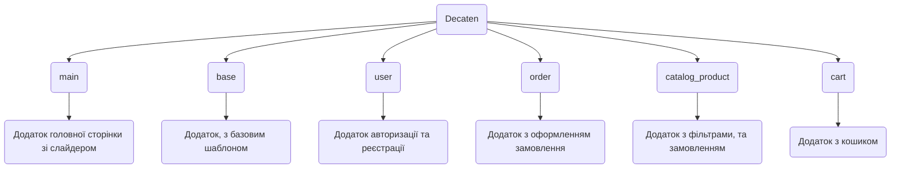

# Decaten
Decaten - це проект, присвячений створенню та підтримці магазину електронних сигарет. Наша мета - забезпечити клієнтам доступ до високоякісних продуктів із сегменту вейпінгу та електронних сигарет за доступними цінами. Використовуючи новітні технології у розробці програмного забезпечення та веб-дизайну, ми забезпечуємо зручну і безпечну платформу для покупок із широким вибором товарів і персоналізованим сервісом для кожного клієнта.

# Змiст
- [Decaten](#decaten)
- [Змiст](#змiст)
- [Запуск та встановлення](#запуск-та-встановлення)
    - [Якщо є Django](#якщо-є-django)
    - [Якщо немає Django](#якщо-немає-django)
- [Учасники команди](#учасники-команди)
- [Опис сторінок проекту](#опис-сторінок-проекту)
- [Використані технології](#використані-технології)
- [Figma та FigJam](#figma-та-figjam)
- [Структура проекту](#структура-проекту)
- [Функціонал проекту](#функціонал-проекту)
  - [Додаток base](#додаток-base)
    - [JavaScript файли](#javascript-файли)
      - [burger.js](#burgerjs)
  - [Додаток cart](#додаток-cart)
    - [Файл з моделями (models.py)](#файл-з-моделями-modelspy)
    - [Файл з функціями відображення (views.py)](#файл-з-функціями-відображення-viewspy)
    - [Файли JavaScript](#файли-javascript)
      - [cart.js](#cartjs)
      - [minus\_count.js](#minus_countjs)
      - [plus\_count.js](#plus_countjs)
      - [delete\_product.js](#delete_productjs)
  - [Додаток catalog\_product](#додаток-catalog_product)
    - [Файл з моделями (models.py)](#файл-з-моделями-modelspy-1)
    - [Файл з функціями відображення (views.py)](#файл-з-функціями-відображення-viewspy-1)
    - [Файли JavaScript](#файли-javascript-1)
      - [add\_to\_cart.js](#add_to_cartjs)
      - [catalog.js](#catalogjs)
      - [flavour.js](#flavourjs)
      - [price.js](#pricejs)
      - [product\_image.js](#product_imagejs)
  - [Додаток main](#додаток-main)
    - [Файл з моделями (models.py)](#файл-з-моделями-modelspy-2)
    - [Файл з функціями відображення (views.py)](#файл-з-функціями-відображення-viewspy-2)
    - [Файли JavaScript](#файли-javascript-2)
      - [product\_flavour\_main.js](#product_flavour_mainjs)
      - [product\_image\_main.js](#product_image_mainjs)
  - [Додаток my\_order](#додаток-my_order)
    - [Файл з моделями](#файл-з-моделями)
    - [Файл з функціями відображення (views.py)](#файл-з-функціями-відображення-viewspy-3)
    - [Файли JavaScript](#файли-javascript-3)
      - [validation.js](#validationjs)
      - [cancel\_order.js](#cancel_orderjs)
      - [my\_order.js](#my_orderjs)
  - [Додаток user](#додаток-user)
    - [Файли відображення (views.py)](#файли-відображення-viewspy)
    - [JavaScript](#javascript)
      - [user.js](#userjs)
      - [log.js](#logjs)

# Запуск та встановлення
- [Якщо є Django](#якщо-є-django)
- [Якщо немає Django](#якщо-немає-django)

### Якщо є Django
1. Завантаження

    Для того щоб запустити проект, потрібно його спочатку завантажити.
    ```
    git clone https://github.com/PrymushAnton/Decaten.git
    ```

2. Запуск
   
    Далі відкриваєте проект у вашому фреймворку і переходьте у папку з ним.
    ```
    cd decaten/decaten
    ```
    Тепер запускаємо проект.
    ```
    python manage.py runserver
    ```

### Якщо немає Django
1. Завантаження

    Для того щоб запустити проект, потрібно завантажити Django.
    ```
    pip install Django
    ```
    Пiсля чого, можно завантажувати проект.
    ```
    git clone https://github.com/PrymushAnton/Decaten.git
    ```

2. Запуск
   
    Далі відкриваєте проект у вашому фреймворку і переходьте у папку з ним.
    ```
    cd decaten/decaten
    ```
    Тепер запускаємо сам проект.
    ```
    python manage.py runserver
    ```

# Учасники команди
1. [Антон Примуш](https://github.com/PrymushAnton) - лідер команди(TeamLead)
2. [Андрiй Дружга](https://github.com/GKAndrey) - кодер та розробник дизайну
3. [Михайло Фатуєв](https://github.com/mishafat) - кодер та розробник дизайну
4. [Ярослав Самчук](https://github.com/YaroslavSamchuk) - кодер та розробник дизайну
   
# Опис сторінок проекту
- **Головна сторiнка** - можливість швидко переглянути наявні пропозиції магазину.
- **Каталог** - на цiй сторiнцi весь список товарiв та фiльтрiв, товар можливо додати до кошику.
- **Кошик** - на цiй сторiнцi можна перевiрити/пiдтвердити замовлення.
- **Авторизацiя та Реєстрація** - на цих сторінках ви можете створити свій акаунт на сайті, та увійти в нього.
# Використані технології
Список бібліотек і технологій, які використовуються в проекті.


- HTML - використовується створення тіла для сторінок
- CSS - використовується створення стилів для сторінок
- Javascript - використовується для front-end розробки
- Python/Django - використовується для back-end розробки
- AJAX - використовується для запобігання перезавантаженню сторінки
- JQuery - використовується для front-end розробки
- Bootstrap 5 - використовується для створення корисних елементів
- SQLite3 - використовується для збереження даних

# Figma та FigJam
- [Figma](https://www.figma.com/design/He9uAMtimSi7BggXDkfste/Decaten?node-id=0-1&t=tU8DNRnSG5MQx48n-1)
- [FigJam](https://www.figma.com/board/FJDA9tQkrUKBHibZFNrBFG/Untitled?node-id=1-14&t=dndBAdC8D6cRroU6-1)

# Структура проекту



# Функціонал проекту

## Додаток base

### JavaScript файли

#### burger.js

Цей файл відповідає за відображення бургер меню (на телефоні)

```javascript
// Коли сторінка завантажилась
$(document).ready(function(){
    // Відкриваємо бургер меню, якщо була натиснута кнопка відкриття
    $('.burger_icon').click(function(){
        $('.header_list').attr('id', 'open')
        $(".burger_close").attr('id', 'burger_open_icon')
        $('.burger_icon').attr('id', 'burger_close_icon')
    })
    // Закриваємо бургер меню, якщо була натиснута кнопка закриття
    $('.burger_close').click(function(){
        $('.header_list').removeAttr('id')
        $(".burger_close").attr('id', 'burger_close_icon')
        $('.burger_icon').attr('id', 'burger_open_icon')
    })

})
```

## Додаток cart
### Файл з моделями (models.py)
```python
# Модель кошику, який створюється за допомогою сесіоного ключа користувача
class Cart(models.Model):
    # Поле, яке відповідає за сесіоний ключ користувача
    sessionkey = models.CharField(max_length=255)

# Модель продукту в кошику
class ProductInCart(models.Model):
    # Поле, яке відповідає за продукт, який було додано до моделі
    product=models.ForeignKey(Product,on_delete=models.CASCADE)
    # Це поле визначає, до якого кошику було додано продукт
    cart=models.ForeignKey(Cart,on_delete=models.CASCADE)
    # Це поле визначає кількість продукту, який було додано в кошик
    count=models.IntegerField()
    # Це поле визначає смак продукту, який було додано в кошик
    flavour = models.ForeignKey(Flavour, on_delete=models.CASCADE, blank=True, null=True)
```
### Файл з функціями відображення (views.py)
```python
# Функція, яка відподає за відображення сторінки кошику
def cart(request):
    # отримуємо сесіоний ключ користувача та записуємо його у змінну
    session_key = request.session.session_key
    # якщо сесіоного ключа немає, тоді створюємо його і записуємо у змінну
    if not session_key:
        request.session.cycle_key()
        session_key = request.session.session_key
    
    # отримуємо всі смаки
    flavours = Flavour.objects.all()

    # намагаємось отримати корзину по сесіоному ключю, якщо вона є
    try:
        cart = Cart.objects.get(sessionkey=session_key)
    # якщо корзину не вдалось знайти, то створюємо її
    except:
        cart = Cart.objects.create(sessionkey=session_key)
        
    # створюємо список, в якому будуть ціни товарів
    prices = []
    # змінна для відображення у хедері кількості всіх товарів у корзині
    count = 0
    # перебираємо queryset з значеннями всіх товарів у корзині
    # cart.productincart_set.all() отримує queryset зі значеннями всіх продуктів, які зберігаються у корзині cart
    for product in cart.productincart_set.all():
        # Фільтруємо та отримуємо значення всіх продуктів, які були у кошику, після чого записуємо їх у список
        product_obj = Product.objects.filter(id=product.product_id).values()
        product_obj = list(product_obj)
        # додаємо до списку з цінами ціну товару, помножену на кількість товару у кошику.
        prices.append(int(product_obj[0]['price']) * product.count)
        # Додаємо кількість товару для відображення у хедері
        count += product.count
        


    context = {
        "products": cart.productincart_set.all(),
        'flavours': flavours,
        'prices': prices,
        'count_cart': count,

    }
    
    return render(request, 'cart/cart.html', context)

# функція, яка відповідає за додавання кількості товару у корзині
def plus_count(request):
    # отримуємо сесіоний ключ користувача та записуємо його у змінну
    session_key = request.session.session_key
    # якщо сесіоного ключа немає, тоді створюємо його і записуємо у змінну
    if not session_key:
        request.session.cycle_key()
        session_key = request.session.session_key
        
    # намагаємось отримати корзину по сесіоному ключю, якщо вона є
    try:
        cart = Cart.objects.get(sessionkey=session_key)
    # якщо корзину не вдалось знайти, то створюємо її
    except:
        cart = Cart.objects.create(sessionkey=session_key)
        
    
    
    try:
        # Отримуємо строку з id товару і смаку товару та перероблюємо її у список
        hidden_input = request.POST.get('product_id')
        hidden_input = hidden_input.split(',')

        # отримуємо значення продукту, який ми отримали за значенням зі списку
        product_obj = Product.objects.filter(id=hidden_input[1]).values()
        # отримуємо ціну продукту
        price = list(product_obj)[0]['price']
        # отримуємо значення смаку та перероблюємо їх у список, який ми отримуємо за значенням зі списку
        flavour = Flavour.objects.filter(id=hidden_input[0]).values()
        flavour = list(flavour)
        # Отримуємо продукт з кошику за допомогою значень з списку
        product = cart.productincart_set.get(product_id=hidden_input[1], flavour_id=hidden_input[0])
        # Якщо кількість продукту на складі більша, ніж кількість продукту у корзині
        if flavour[0]['count_of_product'] > product.count:
            # додаємо 1 продукт до кількості продукту
            product.count += 1
            # зберігаємо кількість продукту у змінну
            count = product.count
            # отримуємо ціну, яка помножена на кількість товарів (тобто товар коштує 500 грн, 2 товари будуть коштувати 1000 грн)
            final_price = price * count
            # зберігаємо зміни у продукті
            product.save()
            # створюємо змінну з кількістю товарів в кошику
            count_cart = 0
            # Перебираємо товари в корзині та записуємо кількість товару і змінну
            for product in cart.productincart_set.all():
                product_obj = Product.objects.filter(id=product.product_id).values()
                product_obj = list(product_obj)
                count_cart += product.count
            # Надаємо відповідь у вигляді json
            return JsonResponse({'count_cart':count_cart,'price': final_price,"count": count, 'product_id': hidden_input[1], 'flavour_id': hidden_input[0], 'plus': 1})
        else:
            return JsonResponse({'count_cart':count, 'plus': 0})
    except:
        return HttpResponse()
    
    
    
def minus_count(request):

    # отримуємо сесіоний ключ користувача та записуємо його у змінну
    session_key = request.session.session_key
    # якщо сесіоного ключа немає, тоді створюємо його і записуємо у змінну
    if not session_key:
        request.session.cycle_key()
        session_key = request.session.session_key
        
    # намагаємось отримати корзину по сесіоному ключю, якщо вона є
    try:
        cart = Cart.objects.get(sessionkey=session_key)
    # якщо корзину не вдалось знайти, то створюємо її
    except:
        cart = Cart.objects.create(sessionkey=session_key)
    
    
    try:
        # Отримуємо строку з id товару і смаку товару та перероблюємо її у список
        hidden_input = request.POST.get('product_id')
        hidden_input = hidden_input.split(',')
        # отримуємо значення продукту, який ми отримали за значенням зі списку
        product_obj = Product.objects.filter(id=hidden_input[1]).values()
        # отримуємо ціну продукту
        price = list(product_obj)[0]['price']
        # Отримуємо товар в корзині за значеннями зі списку
        product = cart.productincart_set.get(product_id=hidden_input[1], flavour_id=hidden_input[0])
        # Якщо кількість товару більше або дорівнює 1, то віднімаємо від кількості товару 1 та зберігаємо
        if int(product.count) >= 1:
            product.count -= 1
            product.save()
        # Якщо кількість товару менше 1, то видаляємо продукт з корзини
        if int(product.count) < 1:
            product.delete()
        # Отримуємо кількість продукту у кошику і зберігаємо це у змінну
        count = product.count
        # Записуємо фінальну ціну товару (ціна помножена на кількість товару)
        final_price = price * count
        # створюємо змінну з кількістю товарів в кошику
        count_cart = 0
        # Перебираємо товари в корзині та записуємо кількість товару і змінну
        for product in cart.productincart_set.all():
            product_obj = Product.objects.filter(id=product.product_id).values()
            product_obj = list(product_obj)
            count_cart += product.count
        # Надаємо відповідь у вигляді json
        return JsonResponse({'count_cart':count_cart,'price': final_price,"count": count, 'product_id': hidden_input[1], 'flavour_id': hidden_input[0]})
    except:
        return HttpResponse()
    


def delete_product(request):
    # отримуємо сесіоний ключ користувача та записуємо його у змінну
    session_key = request.session.session_key
    # якщо сесіоного ключа немає, тоді створюємо його і записуємо у змінну
    if not session_key:
        request.session.cycle_key()
        session_key = request.session.session_key
    # намагаємось отримати корзину по сесіоному ключю, якщо вона є  
    try:
        cart = Cart.objects.get(sessionkey=session_key)
    # якщо корзину не вдалось знайти, то створюємо її
    except:
        cart = Cart.objects.create(sessionkey=session_key)
    
    
    try:
        # Отримуємо строку з id товару і смаку товару та перероблюємо її у список
        hidden_input = request.POST.get('product_id')
        hidden_input = hidden_input.split(',')
        # отримуємо продукт з корзини за значеннями з списку
        product = cart.productincart_set.get(product_id=hidden_input[1], flavour_id=hidden_input[0])
        # Видаляємо товар з корзини
        product.delete()
        
        products = list(cart.productincart_set.all().values())
        print(products)
        # створюємо змінну з кількістю товарів в кошику
        count = 0
        # Перебираємо товари в корзині та записуємо кількість товару і змінну
        for product in cart.productincart_set.all():
            product_obj = Product.objects.filter(id=product.product_id).values()
            product_obj = list(product_obj)
            count += product.count
        print(count)
        # Надаємо відповідь у вигляді json
        return JsonResponse({'product_id': hidden_input[1], 'flavour_id': hidden_input[0], 'count_cart': count})
    except:
        return HttpResponse()


def error_empty(request):
    # отримуємо сесіоний ключ користувача та записуємо його у змінну
    session_key = request.session.session_key
    # якщо сесіоного ключа немає, тоді створюємо його і записуємо у змінну
    if not session_key:
        request.session.cycle_key()
        session_key = request.session.session_key
    # намагаємось отримати корзину по сесіоному ключю, якщо вона є  
    try:
        cart = Cart.objects.get(sessionkey=session_key)
    # якщо корзину не вдалось знайти, то створюємо її
    except:
        cart = Cart.objects.create(sessionkey=session_key)

    # отримуємо списток з значеннями всіх товарів в корзині
    cart = list(cart.productincart_set.all().values())
    # Надаємо відповідь у вигляді json 
    return JsonResponse({"products": cart})
```

### Файли JavaScript
#### cart.js
Цей файл відповідає за відображення помилки відсутності товарів у кошику при завантаженні сторінки, якщо товару в кошику немає.
```javascript
// Коли сторінка завантажилась
$(document).ready(function() {
    // Викликаємо ajax запрос
    $.ajax({
        url: 'error_empty/',
        type: 'GET',
        data: {},
        // При отриманні відповіді перевіряємо, якщо кількість товару в корзині дорінює 0, то відображаємо помилку, яка каже, що кошик пустий
        success: function(data) {
            // Якщо довжина списку з значенням товарів у кошику дорівнює 0, то відображаємо помилку, яка каже, що кошик пустий
            if (data.products.length == 0){
                $('.error_empty').css('display', 'flex')
            }
        }
    })
})
```
#### minus_count.js
Цей файл відповідає за віднімання кількості товару у кошику.
```javascript
// Коли сторінка завантажилась
$(document).ready(function() {
    // при натисканні на кнопку мінус на товарі у кошику
    $(".minus").click(function(e){
        // запобігаємо відправленню форми напряму на back-end
        e.preventDefault()
        // Викликаємо ajax запрос
        $.ajax({
            url: 'minus_count/',
            type: "POST",
            data: {
                product_id: $(this).val(),
                csrfmiddlewaretoken: $("input[name=csrfmiddlewaretoken]").val()
            },
            success: function(data){
                // Якщо кількість товару, на якому натиснули кнопку мінус, більше 0, то оновлюємо кількість товару, який було додано. Також оновлюємо кількість товару в кошику у хедері. 
                // Якщо кількість всіх товарів більше 99, то кількість товарів у хедері буде 99+
                if (data.count > 0) {
                    $('.product_count_'+`${data.product_id}`+'_'+`${data.flavour_id}`).html('Кількість: '+data.count)
                    $('#price_'+`${data.product_id}`+'_'+`${data.flavour_id}`).html(data.price+' грн')
                    // Якщо кількість всіх товарів в корзині більше 99
                    if (data.count_cart > '99'){
                        // Якщо пристрій користувача - телефон, то додаємо кількість товару (99+) в хедер на телефон, інакше - на комп'ютер
                        if ($('.cart').css('display') == 'none'){
                            $('#count_cart_phone').html('99+')
                        } else {
                            $('#count_cart').html('99+')
                        }
                    // Якщо кількість всіх товарів в корзині менше 99
                    } else {
                        // Якщо пристрій користувача - телефон, то додаємо кількість товару в хедер на телефон, інакше - на комп'ютер
                        if ($('.cart').css('display') == 'none'){
                            $('#count_cart_phone').html(data.count_cart)
                        } else {
                            $('#count_cart').html(data.count_cart)
                        }
                    }
                }
                // Якщо кількість товару, на якому було натиснуто кнопку мінус, менше 1, то видаляємо карточку цього товару.
                // Якщо кількість всіх товарів більше 99, то кількість товарів у хедері буде 99+
                if (data.count < 1) {
                    $(".card_"+`${data.product_id}`+'_'+`${data.flavour_id}`).remove()
                    // Якщо кількість всіх товарів в корзині більше 99
                    if (data.count_cart > '99'){
                        // Якщо пристрій користувача - телефон, то додаємо кількість товару (99+) в хедер на телефон, інакше - на комп'ютер
                        if ($('.cart').css('display') == 'none'){
                            $('#count_cart_phone').html('99+')
                        } else {
                            $('#count_cart').html('99+')
                        }
                    // Якщо кількість всіх товарів в корзині менше 99
                    } else {
                        // Якщо пристрій користувача - телефон, то додаємо кількість товару в хедер на телефон, інакше - на комп'ютер
                        if ($('.cart').css('display') == 'none'){
                            $('#count_cart_phone').html(data.count_cart)
                        } else {
                            $('#count_cart').html(data.count_cart)
                        }
                    }
                }
                // Якщо кількість всіх товарів в кошику менше 1, то показуємо помилку, що в кошику немає товарів.
                if (data.count_cart < 1){
                    $('.error_empty').css('display', 'flex')
                    // Якщо пристрій користувача - телефон, то додаємо кількість товару в хедер на телефон, інакше - на комп'ютер
                    if ($('.cart').css('display') == 'none'){
                        $('#count_cart_phone').css('display', 'none')
                    } else {
                        $('#count_cart').css('display', 'none')
                    }
                    
                }
                // Якщо помилка відсутності товарів у корзині показана, то кнопку "оформити замовлення" не показується
                if ($('.error_empty').css('display') == 'flex') {
                    $(".make_order").css('display', 'none')
                }
                
            }
        })
    })
})
```
#### plus_count.js
Цей файл відповідає за додавання кількості товару у кошику.
```javascript
// Коли сторінка завантажилась
$(document).ready(function() {
    // при натисканні на кнопку додати на товарі у кошику
    $(".plus").click(function(e){
        // запобігаємо відправленню форми напряму на back-end
        e.preventDefault()
        // Викликаємо ajax запрос
        $.ajax({
            url: 'plus_count/',
            type: "POST",
            data: {
                product_id: $(this).val(),
                csrfmiddlewaretoken: $("input[name=csrfmiddlewaretoken]").val()
            },
            success: function(data){
                // Якщо немає помилки на back-end, то додаємо до кількості товару 1
                // Якщо кількість всіх товарів більше 99, то кількість товарів у хедері буде 99+
                if (data.plus == 1){
                    $('.product_count_'+`${data.product_id}`+'_'+`${data.flavour_id}`).html('Кількість: '+data.count)
                    $('#price_'+`${data.product_id}`+'_'+`${data.flavour_id}`).html(data.price+' грн')
                    // Якщо кількість всіх товарів в корзині більше 99
                    if (data.count_cart > '99'){
                        // Якщо пристрій користувача - телефон, то додаємо кількість товару (99+) в хедер на телефон, інакше - на комп'ютер
                        if ($('.cart').css('display') == 'none'){
                            $('#count_cart_phone').html('99+')
                        } else {
                            $('#count_cart').html('99+')
                        }
                    // Якщо кількість всіх товарів в корзині менше 99
                    } else {
                        // Якщо пристрій користувача - телефон, то додаємо кількість товару в хедер на телефон, інакше - на комп'ютер
                        if ($('.cart').css('display') == 'none'){
                            $('#count_cart_phone').html(data.count_cart)
                        } else {
                            $('#count_cart').html(data.count_cart)
                        }
                    }
                }
                
            }
        })
    })
})
```

#### delete_product.js
Цей файл відповідає за видалення товару з кошику.
```javascript
// Коли сторінка завантажилась
$(document).ready(function() {
    // при натисканні на кнопку видалити на товарі у кошику
    $(".delete").click(function(e){
        // запобігаємо відправленню форми напряму на back-end
        e.preventDefault()
        // Викликаємо ajax запрос
        $.ajax({
            url: 'delete_product/',
            type: "POST",
            data: {
                product_id: $(this).val(),
                csrfmiddlewaretoken: $("input[name=csrfmiddlewaretoken]").val()
            },
            success: function(data){
                // Видаляємо карточку товару з кошику
                $(".card_"+`${data.product_id}`+'_'+`${data.flavour_id}`).remove()
                // Якщо кількість всього товару у кошику дорівнює 0, то показуємо помилку відсутності товарів у кошику, та видаляємо кількість всього товару в хедері
                if (data.count_cart == '0'){
                    $('.error_empty').css('display', 'flex')
                    // Якщо пристрій користувача телефон - видаляємо кількість всього товару з хедера для телефону
                    if ($('.cart').css('display') == 'none'){
                        $('#count_cart_phone').css('display', 'none')
                    // Якщо пристрій користувача комп'ютер - видаляємо кількість всього товару з хедера для комп'ютера
                    } else {
                        $('#count_cart').css('display', 'none')
                    }
                // Якщо кількість товару не дорівнює 0, то оновлюємо кількість всього товару в хедері
                } else {
                    // Якщо пристрій користувача телефон - оновлюємо кількість всього товару з хедера для телефону
                    if ($('.cart').css('display') == 'none'){
                        $('#count_cart_phone').html(data.count_cart)
                    // Якщо пристрій користувача комп'ютер - оновлюємо кількість всього товару з хедера для комп'ютера
                    } else {
                        $('#count_cart').html(data.count_cart)
                    }
                }
                // Якщо помилка відсутності товарів у корзині показана, то кнопку "оформити замовлення" не показується
                if ($('.error_empty').css('display') == 'flex') {
                    $(".make_order").css('display', 'none')
                }
            }
        })
    })
})
```
## Додаток catalog_product
### Файл з моделями (models.py)
```python
class NameOfFilter(models.Model):
    # поле, яке відповідає за назву категорії фільтрів (наприклад "Кількість затяжок")
    name = models.CharField(max_length=255)
    # відповідає за зручне відображення назви у адмін панелі
    def __str__(self):
        return self.name
    
class Filter(models.Model):
    # поле, яке відповідає за назву нового фільтру в категорії (наприклад назва "8000" в категорії "Кількість затяжок")
    name = models.CharField(max_length=255)
    # поле, яке визначає, якій категорії належить новий фільтр
    name_of_filter = models.ForeignKey(NameOfFilter, on_delete=models.CASCADE)
    # відповідає за зручне відображення назви у адмін панелі
    def __str__(self):
        return self.name
    

class Product(models.Model):
    image = models.ImageField(null=True, blank=True)
    # поле, яке визначає назву продукту
    name = models.CharField(max_length=255)
    # ціна продукту
    price = models.IntegerField()
    # поле, яке приймає одне або декілька значень фільтрів.
    filters = models.ManyToManyField(Filter)
    # відповідає за зручне відображення назви у адмін панелі
    def __str__(self):
        return self.name
    

class Flavour(models.Model):
    # назва смаку сигарети
    name = models.CharField(max_length=255)
    # це поле визначає, до якого продукту відноситься цей смак
    for_product = models.ForeignKey(Product, on_delete=models.CASCADE, blank=True, null=True)
    # картинка сигарети з смаком
    image = models.ImageField(blank=True, null=True)
    # це поле визначає кількість товарів цього смаку на складі
    count_of_product = models.IntegerField(null=True, blank=True)
    # відповідає за зручне відображення назви у адмін панелі
    def __str__(self):
        return self.name
```
### Файл з функціями відображення (views.py)
```python
# Ця функція відповідає за завантаження сторінки каталогу
def catalog(request):
    # Отримуємо всі категорії товарів
    names_of_filters = NameOfFilter.objects.all()
    # Створюємо список для фільтрів
    filters = []
    # Перебираємо список з категоріями та додаємо всі фільтри до списку
    for name_of_filter in names_of_filters:
        # Отримуємо об'єкт категорії за значенням, яке отримали при переборі
        name_of_filter = NameOfFilter.objects.get(name=name_of_filter)
        try:
            # Отримуємо фільтр за категорією
            semi_filter = Filter.objects.filter(name_of_filter = name_of_filter)
            # Додаємо фільтр у список
            filters.append(semi_filter)
        except:
            continue
    # Отримуємо всі продукти
    all_products = Product.objects.all()
    # Отримуємо значення всіх продуктів та записуємо їх у список
    products_values = Product.objects.all().values()
    products_values = list(products_values)
    # Створюємо список з цінами
    prices = []
    # Перебираємо список з значеннями товарів
    for value in products_values:
        # Додаємо до списку ціну товару
        prices.append(int(value['price']))
        
    # Знаходимо максимальну та мінімальну ціну із списку з цінами
    max_price = max(prices)
    min_price = min(prices)
    # Отримуємо кількість продуктів
    amount_of_products = len(Product.objects.all())
    # Отримуємо всі смаки
    all_flavours = Flavour.objects.all()
    
    
    # отримуємо сесіоний ключ користувача та записуємо його у змінну
    session_key = request.session.session_key
    # якщо сесіоного ключа немає, тоді створюємо його і записуємо у змінну
    if not session_key:
        request.session.cycle_key()
        session_key = request.session.session_key
        
    # намагаємось отримати корзину по сесіоному ключю, якщо вона є
    try:
        cart = Cart.objects.get(sessionkey=session_key)
    # якщо корзину не вдалось знайти, то створюємо її
    except:
        cart = Cart.objects.create(sessionkey=session_key)
    

    # створюємо змінну з кількістю товарів в кошику
    count_cart = 0
    # Перебираємо товари в корзині та записуємо кількість товару і змінну
    for product in cart.productincart_set.all():
        product_obj = Product.objects.filter(id=product.product_id).values()
        product_obj = list(product_obj)
        count_cart += product.count
    
    # Створюємо словник з даними, які будуть передані у html файл
    context = {
        'names_of_filters': names_of_filters,
        'list_of_filters': filters,
        'all_products': all_products,
        'amount_of_products': amount_of_products,
        'all_flavours': all_flavours,
        'min_price': min_price,
        'max_price': max_price,
        'count_cart': count,
    }
    
    return render(request, 'catalog_product/catalog.html', context)

# Ця функція відповідає за фільтрацію товарів
def filter_products(request):
    # Отримуємо строку з списком у вигляді '[[],[],[],...]', де списки, які знаходяться внутрі, відповідають за категорії фільтрів
    filters_true = request.POST.get('filters_true')
    
    # Перероблюємо строку у список з списками
    filters_true = ast.literal_eval(filters_true)
    

    # Отримуємо строку з списком у вигляді '[[],[],[],...]', де списки, які знаходяться внутрі, відповідають за категорії фільтрів
    products_true = request.POST.get('filters_true')
    # Перероблюємо строку у список з списками
    products_true = ast.literal_eval(products_true)
    # Переюираємо список з списками, де видаляємо всі значення внутрішніх списків
    for product_list in products_true:
        product_list.clear()
    # Робимо змінну, яка набуває значення 1, якщо товар за фільтрами не було знайдено
    error = None

    # Отримуємо максимльну та мінімальну ціни всіх товарів (використовується у фільтрі ціни)
    max_price = request.POST.get('max_price')
    min_price = request.POST.get('min_price')
    # Отримуємо значення всіх продуктів
    all_products = Product.objects.all().values()
    # Створюємо список з продуктами, фільтрованими за ціною
    filtered_products_by_price_ids = []
    # Перебираємо список з значеннями всіх продуктів
    for product in all_products:
        # Якщо ціна продукту більша або дорівнює за мінімальну ціну всіх товарів та ціна продукту менша або дорівнює за найбільшу ціну всіх товарів, то додаємо id цього товару до списку
        if int(product['price']) >= int(min_price) and int(product['price']) <= int(max_price):
            filtered_products_by_price_ids.append(int(product['id']))
        
    # Фільтруємо продукти та отримуємо queryset за списком id товарів, який було попередньо наповнено (або ні) товарами, чия ціна входить в діапазон цін
    products_price = Product.objects.filter(id__in=filtered_products_by_price_ids)
    # Створюємо лічильник
    count = 0
    # Перебираємо список з пустими списками, та отримуємо у змінну filter_list список з фільтрами (окрема категорія).
    for filter_list in filters_true:
        # Фільтруємо продукти за фільтрами
        product = Product.objects.filter(filters__in=filter_list)
        # Додаємо продукт у відповідний список за лічильником (в окрему категорію)
        products_true[count].append(product)
        count += 1
    
    # products_true
    # Ця функція повертає queryset, перетворений у список
    def get_products(queryset):
        return list(queryset)
    
    # Створюємо список, до якого додаємо перетворений queryset у список за допомогою функції get_products. 
    # Сам queryset отримуємо за допомогою циклу, який перебирає список з списками продуктів та якщо у списку з списками є queryset, ми викликаємо функцію get_products
    list_of_product_lists = [get_products(qs[0]) for qs in products_true if qs]

    # Створюємо новий список, який наповнюємо списками з списку list_of_product_lists, якщо вони не пусті
    filtered_lists = [lst for lst in list_of_product_lists if lst]

    # Якщо є хоча б один непорожній список у списку filtered_lists, знаходимо спільні елементи
    if filtered_lists:
        # Перетворюємо нульовий список filtered_lists у set (множину)
        common_items = set(filtered_lists[0])
        # Перебираємо список, починаючи з 2 елемента
        for lst in filtered_lists[1:]:
            # Додаємо до множини (set) счписок lst, при чому у множині будуть тільки спільні значення множини і списку через те, що була використана функція intersection_update
            common_items.intersection_update(lst)
        # Перетворюємо множину назад у список
        common_items = list(common_items)
        # Якщо не було знайдено жодного співпадіння (довжина списку common_items дорівнює 0), то помилка набуває значення 1
        if len(common_items) == 0:
            error = 1
    # Якщо всі списки у списку filtered_lists порожні, то створюємо пустий список common_items 
    else:
        common_items = []
    
    # створюємо список у який записуємо id продукту, який ми отримуємо за допомого цикла for, перебираючи список common_items
    values_list = [product.__dict__['id'] for product in common_items]
    # Фільтруємо продукти за списком values_list, у якому є id продуктів
    products = Product.objects.filter(id__in=values_list)

    # Якщо довжина списку з значеннями відфільтрованих продуктів (крім ціни) не дорівнює 0 і довжина списку продуктів, фідфільтрованих по ціні не дорівнює 0
    if len(list(products.values())) != 0 and len(list(products_price.values())) != 0:
        # Знаходимо спільні значення між списком відфільтрованих продуктів за категоріями та списком відфільтрованих продуктів за ціною
        common_products_price = products.intersection(products_price)
        # Якщо довжина списку спільних товарів дорівнює 0, то error набуває значення 1
        if len(list(common_products_price)) == 0:
            error = 1
        # У змінну products записуємо список зі значеннями спільних товарів
        products = list(common_products_price.values())
    # Якщо довжина списку з значеннями фідфільтрованих продуктів по ціні дорівнює 0 і довжина списку продуктів, відфільтрованих по категоріях (крім ціни) дорівнює 0
    elif len(list(products_price.values())) == 0 and len(list(products.values())) == 0:
        # error набуває значення 1
        error = 1
        # У змінну products записуємо список зі значеннями товарів, відфільтрованих по ціні
        products = list(products_price.values())
    # Якщо довжина списку зі значеннями відфільтрованих товарів по категоріях (крім ціни) дорівнює 0
    elif len(list(products.values())) == 0:
        # Якщо довжина списку зі значеннями відфільтрованих товарів по ціні не дорівнює 0 і error не дорівнює 1
        if len(list(products_price.values())) != 0 and error != 1:
            # У змінну products записуємо список зі значеннями товарів, відфільтрованих по ціні
            products = list(products_price.values())
        else:
            # У змінну products записуємо список зі значеннями товарів, відфільтрованих по категорії
            products = list(products.values())
    # Інакше error набуває значення 1
    else:
        error = 1
    # Надаємо відповідь у вигляді json 
    return JsonResponse({'products': products, 'error': error})


# Ця функція змінює картинку у в залежності від того, який смак було обрано
def get_flavour_image(request):
    # Отримуємо значення select та розбиваємо його на список (там будуть id товару та id смаку)
    value_of_selector = request.POST.get('value_of_selector')
    value_of_selector = value_of_selector.split(',')
    # Фільтруємо смаки за id. Отримані значення записуємо у список
    flavour = Flavour.objects.filter(id=value_of_selector[0]).values()
    flavour = list(flavour)
    # Надаємо відповідь у вигляді json 
    return JsonResponse({'flavour': flavour})


# Ця функція відповідає за те, щоб підгрузити картинки до карточок товару
def product_image(request):
    # Отримуємо значення всіх смаків та записуємо їх у список
    flavours = Flavour.objects.all().values()
    flavours = list(flavours)
    # Надаємо відповідь у вигляді json 
    return JsonResponse({"flavours":flavours})

# Ця функція відповідає за відображення сторінки товару
def product_page(request, id):
    context = {}
    try:
        # Записуємо у контекст товар, знайдений по динамічному id
        context = {'product': Product.objects.get(id=id)}
        # Записуємо у контекст смак, знайдений по динамічному id
        context['flaur'] = Flavour.objects.filter(for_product = id)

        # отримуємо сесіоний ключ користувача та записуємо його у змінну
        session_key = request.session.session_key
        # якщо сесіоного ключа немає, тоді створюємо його і записуємо у змінну
        if not session_key:
            request.session.cycle_key()
            session_key = request.session.session_key
            
        # намагаємось отримати корзину по сесіоному ключю, якщо вона є
        try:
            cart = Cart.objects.get(sessionkey=session_key)
        # якщо корзину не вдалось знайти, то створюємо її
        except:
            cart = Cart.objects.create(sessionkey=session_key)


        # створюємо змінну з кількістю товарів в кошику
        count = 0
        # Перебираємо товари в корзині та записуємо кількість товару і змінну
        for product in cart.productincart_set.all():
            product_obj = Product.objects.filter(id=product.product_id).values()
            product_obj = list(product_obj)
            count += product.count
        # Записуємо її у контекст
        context['count_cart'] = count

        
        id_of_filters = []
        name_of_filters = []
        # Отримуємо товар по id
        products = Product.objects.filter(id=id)
        
        
        product_filters = []
        
        list_of_names = []
        list_of_filters = []
        # Перебираємо queryset товару. Ми це робимо для того, щоб на сторінку передати категорії та фільтри цих категорій (Кількість затяжок:8000)
        for product in products:
            # Отримуємо список з словниками, в яких є id name_of_filter (категорії) та name (назви фільтру)
            product_filters_objs = list(product.filters.values('name_of_filter','name'))

            count = 0
            # Перебираємо список product_filters_objs
            for product_obj in product_filters_objs:
                count += 1
                # Створюємо тимчасовий список
                list_temp = []

                # Отримуємо список з словником однієї категорії
                name_of_filter = NameOfFilter.objects.filter(id=int(product_obj['name_of_filter'])).values('name')
                name_of_filter = list(name_of_filter)

                # Отримуємо назви фільтрів та записуємо їх у список
                filter = Filter.objects.filter(name=product_obj['name']).values('name')
                filter = list(filter)
                # Тимчасовий список набуває значення: 1 - назва категорії, 2 - назва фільтру
                list_temp = [name_of_filter[0]['name']+':', filter[0]['name']]
                # до списку з фільтрами додаємо тимчасовий список
                list_of_filters.append(list_temp)
                # очищаємо тимчасовий список
                list_temp = []
        # Записуємо список фільтрів до контексту
        context['list_of_filters'] = list_of_filters
    except:
        pass
    
   
    return render(request, 'catalog_product/product.html', context)

# Ця функція відповідає за додавання товару до кошика
def add_to_cart(request):
    # Отримуємо значення select та перероблюємо його у список. Список буде мати id смаку та id товару
    select = request.POST.get('selector')
    select = select.split(',')


    # отримуємо сесіоний ключ користувача та записуємо його у змінну
    session_key = request.session.session_key
    # якщо сесіоного ключа немає, тоді створюємо його і записуємо у змінну
    if not session_key:
        request.session.cycle_key()
        session_key = request.session.session_key
        
    # намагаємось отримати корзину по сесіоному ключю, якщо вона є
    try:
        cart = Cart.objects.get(sessionkey=session_key)
    # якщо корзину не вдалось знайти, то створюємо її
    except:
        cart = Cart.objects.create(sessionkey=session_key)
    
        
    # Отримуємо значення смаку за id зі списку та записуємо його у список
    flavour = Flavour.objects.filter(id=select[0]).values()
    flavour = list(flavour)
    # намагаємось отримати товар за id продукту та смаку. Якщо такого товару у кошику не існує - переходимо до except та створюємо його.
    try:
        # Отримуємо товар з корзини за id товару та смаку з списку
        product = cart.productincart_set.get(product_id=select[1], flavour_id=select[0])
        # якщо кількість товару з таким смаком на складі більша, ніж кількість товару у кошику, то додаємо до кількості товару у кошику 1 і зберігаємо
        if flavour[0]['count_of_product'] > product.count:
            product.count += 1
            product.save()
        else:
            pass
    # Якщо товару не існує у кошику
    except:
        # Якщо кількість товару з таким смаком на складі більша, ніж 0, тоді додаємо товар до кошику
        if flavour[0]['count_of_product'] > 0:
            product = cart.productincart_set.create(product_id=select[1], flavour_id=select[0], count=1)
        else:
            pass
        
    # створюємо змінну з кількістю товарів в кошику
    count = 0
    # Перебираємо товари в корзині та записуємо кількість товару і змінну
    for product in cart.productincart_set.all():
        product_obj = Product.objects.filter(id=product.product_id).values()
        product_obj = list(product_obj)
        count += product.count

    # Надаємо відповідь у вигляді json 
    return JsonResponse({'count_cart':count_cart})
```

### Файли JavaScript
#### add_to_cart.js
Цей файл відповідає за додавання товару у кошик
```javascript
// Якщо сторінка завантажилась
$(document).ready(function() {
    // якщо була натиснута кнопка додавання у кошик
    $(".add_to_cart").click(function(e){
        // не дозволяємо надіслати форму на back-end
        e.preventDefault()
        // викликаємо ajax запит
        $.ajax({
            url: '../../add_to_cart/',
            type: "POST",
            data: {
                product_id: $('.id_product').val(),
                selector: $('select').val(),
                csrfmiddlewaretoken: $("input[name=csrfmiddlewaretoken]").val()
            },
            success: function(data){
                // Якщо пристрій користувача телефон - додаємо кількість всього товару в хедер для телефону
                if ($('.cart').css('display') == 'none'){
                    $('.cart_phone').empty()
                    $('.cart_phone').append(`Кошик<span id="count_cart_phone">${data.count_cart}</span>`)
                // Якщо пристрій користувача комп'ютер - додаємо кількість всього товару в хедер для комп'ютеру
                } else {
                    $('.cart').empty()
                    $('.cart').append(`<span id="count_cart">${data.count_cart}</span>`)
                    $('.cart').append('Кошик')
                }
                // Відображаємо кількість товару в хедері
                $("#count_cart").css('display', 'inline !important')
                $('#count_cart').html(data.count_cart)
            }
        })
    })
})
```

#### catalog.js
Цей файл відповідає за відображення товарів, які пройшли фільтрацію, чи помилки, якщо жодний товар не пройшов фільтрацію
```javascript
// Якщо сторінка завантажилась
$(document).ready(function(){
    // якщо була натиснута кнопка відправки фільтрів
    $('.send_filters').click(function(e){
        // не дозволяємо надіслати форму на back-end
        e.preventDefault();
        // створюємо списки, в яких будуть зберігатись списки категорій, в яких будуть обрані фільтри цієї категорії
        var filters_true = []
        var filter_true_phone = []
        // отримуємо div всіх категорій на комп'ютері
        var divs = document.querySelectorAll('.filter_category_pc')
        // перебираємо ці div
        for (let div of divs){
            // створюємо тимчасовий список
            var temp_list = []
            // отримуємо всі div, в яких є checkbox фільтрів (на комп'ютері)
            var div_check = div.querySelectorAll('.check_pc')
            // перебираємо ці div
            for (let div_obj of div_check){
                // отримуємо всі input цього div
                var input = div_obj.querySelector('input')
                // якщо input типу checkbox був натиснутий (checked), то додаємо до тимчасового списку значення цього input (у value зберігається id of input)
                if (input.checked){
                    temp_list.push(parseInt(input.value))
                }
            }
            // додаємо до категорій фільтрів комп'ютеру тимчасовий список
            filters_true.push(temp_list)
        }
        // отримуємо div всіх категорій на телефоні
        var divs_phone = document.querySelectorAll('.filter_category_phone')
        // перебираємо ці div
        for (let div_phone of divs_phone){
            // створюємо тимчасовий список
            var temp_list = []
            // отримуємо всі div, в яких є checkbox фільтрів (на телефоні)
            var div_check = div_phone.querySelectorAll('.check_phone')
            // перебираємо ці div
            for (let div_obj of div_check){
                // отримуємо всі input цього div
                var input = div_obj.querySelector('input')
                // якщо input типу checkbox був натиснутий (checked), то додаємо до тимчасового списку значення цього input (у value зберігається id of input)
                if (input.checked){
                    temp_list.push(parseInt(input.value))
                }
                
            }
            // додаємо до категорій фільтрів телефону тимчасовий список
            filter_true_phone.push(temp_list)
        }
        // робимо змінні для макс., мін. цін, для фільтрів
        var max_price = null
        var min_price = null
        var filters = null
        // якщо пристрій користувача - телефон, то ми беремо дані з секції, яка є тільки на телефоні
        if ($('.filters').css('display') == 'none'){
            max_price = $('.input-max-phone').val()
            min_price = $('.input-min-phone').val()
            filters = filter_true_phone
        // інакше (якщо пристрій користувача - комп'ютер) ми беремо дані з секції, яка є тільки на комп'ютері
        } else {
            max_price = $('.input-max').val()
            min_price = $('.input-min').val()
            filters = filters_true
        }
        // викликаємо ajax запит
        $.ajax({
            url: 'filter_products/',
            type: "POST",
            data: {
                filters_true: JSON.stringify(filters),
                max_price: max_price,
                min_price: min_price,
                csrfmiddlewaretoken: $("input[name=csrfmiddlewaretoken]").val()
            },
            success: function(data){
                // Якщо були передані якісь товари у response та помилка не дорівнює 1, то відображаємо ці товари
                if (data.products.length != 0 & data.error != 1){
                    $('#error').css('display', 'none')
                    $('.card_of_product').css('display', 'none')
                    for (let product of data.products){
                        $('.product_'+product.id).css('display', 'flex')
                    }
                // Якщо продуктів за фільтрамі знайдено не було, то ми відображаємо помилку відстуності товарів за обраними фільтрами.
                } else if (data.error == 1){
                    $('.card_of_product').css('display', 'none')
                    $('#error').css('display', 'block')
                }
            }
        })  
    })
})
```
#### flavour.js
Цей файл відповідає за підвантаження картинки, якщо був обраний інший смак
```javascript
// Якщо сторінка завантажилась
$(document).ready(function() {
    // якщо була обрано якийсь смак
    $('select').on('input', function() {
        // викликаємо ajax запит
        $.ajax({
            url: '../../get_flavour_image/',
            type: 'POST',
            data: {
                csrfmiddlewaretoken: $('input[name="csrfmiddlewaretoken"]').val(),
                value_of_selector: $(this).val(),
            },
            success: function(data) {
                // отримуємо значення смаку
                for (let obj of data.flavour){
                    // якщо кількість товару на складі з цим смаком більше 0, то відображаємо картинку з обраним смаком, скриваємо інформацію, що товарів немає на складі, та активуємо кнопку
                    if (obj.count_of_product > 0){
                        class_image = '.image_flavour' + obj.for_product_id
                        $(class_image).attr('src', '../../media/' + obj.image)
                        $('.add_to_cart').prop('disabled', false)
                        $(".no_product_error").css('display', 'none')
                    // якщо кількість товару на складі з цим смаком меншк 0, то відображаємо картинку з обраним смаком, відображаємо інформацію, що товарів немає на складі, та деактивуємо кнопку
                    } else {
                        class_image = '.image_flavour' + obj.for_product_id
                        $(class_image).attr('src', '../../media/' + obj.image)
                        $('.add_to_cart').prop('disabled', true)
                        $(".no_product_error").css('display', 'block')
                    }
                }
            }
        })
    })
})
```
#### price.js
Цей файл відповідає за функціонування фільтру ціни
```javascript
// визначаємо дистанцію між повзунками
let priceGap = 0;
// робимо функцію, яка відповідає за оновлення лінії прогресу ціни для комп'ютерів
function updateProgress() {
    // отримуємо значення мінімальної та максимальної ціни
    let minVal = parseInt($(".range-input input:eq(0)").val()),
        maxVal = parseInt($(".range-input input:eq(1)").val());
    // отрмуємо мінімальне та максимальне значення повзунків
    let minRange = parseInt($("#min-price-slider").attr("min")),
        maxRange = parseInt($("#max-price-slider").attr("max"));
    // розраховуємо положення лінії прогресу ціни
    let leftValue = ((minVal - minRange) / (maxRange - minRange)) * 100 + "%";
    let rightValue = ((maxRange - maxVal) / (maxRange - minRange)) * 100 + "%";
    // застосовуємо положення лінії прогресу ціни
    $(".progress").css({
        "left": leftValue,
        "right": rightValue
    });
    // додаємо значення до input мінімальної та максимально ціни
    $('.input-min').val(minVal);
    $('.input-max').val(maxVal);
}
// викликаємо функцію
updateProgress();

// якщо було введена якась ціна в якийсь input
$(".price-input input").each(function (index, input) {
    $(input).on("input", function (e) {
        // отримуємо значення всіх input (мін та макс ціна)
        let minPrice = parseInt($(".price-input input:eq(0)").val()),
            maxPrice = parseInt($(".price-input input:eq(1)").val());
        // перевіряємо, що введена ціна не виходить за діапащон цін товарів
        if ((maxPrice - minPrice >= priceGap) && maxPrice <= $("#max-price-slider").attr("max")) {
            // якщо дані було введено в input з класом input-min, то міняємо положення лівого повзунка
            if ($(this).hasClass("input-min")) {
                $("#min-price-slider").val(minPrice);
                updateProgress();
            // якщо дані було введено в input з класом input-max, то міняємо положення правого повзунка
            } else {
                $("#max-price-slider").val(maxPrice);
                updateProgress();
            }
        }
    });
});

// якщо було пересунуто якийсь повзунок
$(".range-input input").each(function (index, input) {
    $(input).on("input", function (e) {
        // отримуємо значення всіх повзунків (мін та макс ціна)
        let minVal = parseInt($(".range-input input:eq(0)").val()),
            maxVal = parseInt($(".range-input input:eq(1)").val());
        // якщо правий повзунок було посунуто лівіше, ніж лівий повзунок, то пересуваємо його правіше, ніж лівий повзунок.
        // якщо лівий повзунок було посунуто правіше, ніж правий повзунок, то пересуваємо його лівіше, ніж правий повзунок.
        if ((maxVal - minVal) < priceGap) {
            // якщо було пересунуто лівий повзунок, то пересуваємо його лівіше, ніж правий повзунок
            if ($(this).hasClass("range-min")) {
                $(".range-input input:eq(0)").val(maxVal - priceGap);
                updateProgress();
            // якщо було пересунуто правий повзунок, то пересуваємо його правіше, ніж лівий повзунок
            } else {
                $(".range-input input:eq(1)").val(minVal + priceGap);
                updateProgress();
            }
        // якщо повзунки не "конфліктують" між собою, то просто оновлюємо лінію прогресу ціни
        } else {
            updateProgress();
        }
    });
});

// робимо функцію, яка відповідає за оновлення лінії прогресу ціни для телефонів
function updateProgressPhone() {
    // отримуємо значення мінімальної та максимальної ціни
    let minVal = parseInt($(".range-input-phone input:eq(0)").val()),
        maxVal = parseInt($(".range-input-phone input:eq(1)").val());
    // отрмуємо мінімальне та максимальне значення повзунків
    let minRange = parseInt($("#min-price-slider-phone").attr("min")),
        maxRange = parseInt($("#max-price-slider-phone").attr("max"));
    // розраховуємо положення лінії прогресу ціни
    let leftValue = ((minVal - minRange) / (maxRange - minRange)) * 100 + "%";
    let rightValue = ((maxRange - maxVal) / (maxRange - minRange)) * 100 + "%";
    // застосовуємо положення лінії прогресу ціни
    $(".progress-phone").css({
        "left": leftValue,
        "right": rightValue
    });
    // додаємо значення до input мінімальної та максимально ціни
    $('.input-min-phone').val(minVal);
    $('.input-max-phone').val(maxVal);
}
// викликаємо функцію
updateProgressPhone();
// якщо було введена якась ціна в якийсь input на телефоні
$(".price-input-phone input").each(function (index, input) {
    $(input).on("input", function (e) {
        // отримуємо значення всіх input (мін та макс ціна)
        let minPrice = parseInt($(".price-input-phone input:eq(0)").val()),
            maxPrice = parseInt($(".price-input-phone input:eq(1)").val());
        // перевіряємо, що введена ціна не виходить за діапащон цін товарів
        if ((maxPrice - minPrice >= priceGap) && maxPrice <= $("#max-price-slider-phone").attr("max")) {
            // якщо дані було введено в input з класом input-min, то міняємо положення лівого повзунка
            if ($(this).hasClass("input-min-phone")) {
                $("#min-price-slider-phone").val(minPrice);
                updateProgress();
            // якщо дані було введено в input з класом input-max, то міняємо положення правого повзунка
            } else {
                $("#max-price-slider-phone").val(maxPrice);
                updateProgress();
            }
        }
    });
});
// якщо було пересунуто якийсь повзунок
$(".range-input-phone input").each(function (index, input) {
    $(input).on("input", function (e) {
        // отримуємо значення всіх повзунків (мін та макс ціна)
        let minVal = parseInt($(".range-input-phone input:eq(0)").val()),
            maxVal = parseInt($(".range-input-phone input:eq(1)").val());
        // якщо правий повзунок було посунуто лівіше, ніж лівий повзунок, то пересуваємо його правіше, ніж лівий повзунок.
        // якщо лівий повзунок було посунуто правіше, ніж правий повзунок, то пересуваємо його лівіше, ніж правий повзунок.
        if ((maxVal - minVal) < priceGap) {
            // якщо було пересунуто лівий повзунок, то пересуваємо його лівіше, ніж правий повзунок
            if ($(this).hasClass("range-min")) {
                $(".range-input-phone input:eq(0)").val(maxVal - priceGap);
                updateProgressPhone();
            // якщо було пересунуто правий повзунок, то пересуваємо його правіше, ніж лівий повзунок
            } else {
                $(".range-input-phone input:eq(1)").val(minVal + priceGap);
                updateProgressPhone();
            }
        // якщо повзунки не "конфліктують" між собою, то просто оновлюємо лінію прогресу ціни
        } else {
            updateProgressPhone();
        }
    });
});
```

#### product_image.js
Цей файл відповідає за підвантаження картинок товарів при завантаженні сторінки
```javascript
// Якщо сторінка завантажилась
$(document).ready(function() {
    // викликаємо ajax запит
    $.ajax({
        url: 'product_image/',
        type: 'GET',
        data: {
        },
        success: function(data) {
            // отримуємо всі input з типом hidden, які відповідають за маркування карточок товарів
            var product_id_image = document.querySelectorAll('.product_id_image')
            // перебираємо список всіх input з типом hidden
            for (product_id of product_id_image) {
                // робимо змінну із значенням input з типом hidden
                let product_id_value = product_id.value
                // якщо картинка у карточки товару не завантажена, то завантажуємо її
                if ($('.image_flavour'+product_id_value).attr('src') == '') {
                    // робимо цикл перебору всіх смаків
                    for (let obj of data.flavours){
                        // якщо товар у смаку співпадає з товаром у hidden input, то завантажуємо картинку. Після чого завершуємо цикл (цикл працює 1 раз)
                        if (obj.for_product_id == product_id.value){
                            let src = '../media/' + obj.image
                            $('.image_flavour'+product_id_value).attr('src', src)
                            break
                        }
                    }
                }
            }
        }
    })
})
```

## Додаток main

### Файл з моделями (models.py)
Ця модель відповідає за зображення у слайдері на головній сторінці

```python
class Carusel(models.Model):
    # це поле відповідає за картинку, яку потім буде підвантажено як окрему сторінку у слайдері
    img = models.ImageField()
```

### Файл з функціями відображення (views.py)
```python
# Ця функція відповідає за відображення головної сторінки
def main(request):
    context = {}
    # отримуємо всі зображення для каруселі
    images_for_carusel = Carusel.objects.all()
    # отримуємо всі продукти
    all_products = Product.objects.all()
    # створюємо список продуктів, куди ввійдуть тільки 4 продукти для головної сторінки
    products = []
    count = 0
    # за допомогою циклу for та лічильнику count додаємо до списку 4 продукти
    for product in all_products:
        count += 1
        if count <= 4:
            products.append(product)


    # отримуємо сесіоний ключ користувача та записуємо його у змінну
    session_key = request.session.session_key
    # якщо сесіоного ключа немає, тоді створюємо його і записуємо у змінну
    if not session_key:
        request.session.cycle_key()
        session_key = request.session.session_key
    
    # отримуємо всі смаки
    flavours = Flavour.objects.all()

    # намагаємось отримати корзину по сесіоному ключю, якщо вона є
    try:
        cart = Cart.objects.get(sessionkey=session_key)
    # якщо корзину не вдалось знайти, то створюємо її
    except:
        cart = Cart.objects.create(sessionkey=session_key)

    # створюємо змінну з кількістю товарів в кошику
    count = 0
    # Перебираємо товари в корзині та записуємо кількість товару і змінну
    for product in cart.productincart_set.all():
        product_obj = Product.objects.filter(id=product.product_id).values()
        product_obj = list(product_obj)
        count += product.count
    
    # Додаємо до контексту інформацію, котра буде відображатись на головній сторінці
    context['images_for_carusel'] = images_for_carusel
    context['products'] = products
    context['all_flavours'] = Flavour.objects.all()
    context['count_cart'] = count
    return render(request, 'main/main.html', context)

# Ця функція змінює картинку у в залежності від того, який смак було обрано
def product_flavour_main(request):
    # Отримуємо значення select та розбиваємо його на список (там будуть id товару та id смаку)
    value_of_selector = request.GET.get('value_of_selector')
    value_of_selector = value_of_selector.split(',')
    # Фільтруємо смаки за id. Отримані значення записуємо у список
    flavour = Flavour.objects.filter(id=value_of_selector[0]).values()
    flavour = list(flavour)

    print(flavour)
    # Надаємо відповідь у вигляді json 
    return JsonResponse({'flavour': flavour})

# Ця функція відповідає за те, щоб підгрузити картинки до карточок товару
def product_image_main(request):
    # Отримуємо значення всіх смаків та записуємо їх у список
    flavours = Flavour.objects.all().values()
    flavours = list(flavours)
    # Надаємо відповідь у вигляді json 
    return JsonResponse({"flavours":flavours})
```
### Файли JavaScript
#### product_flavour_main.js
Цей файл відповідає за підвантаження картинок товарів при обранні іншого смаку
```javascript
// Якщо сторінка завантажилась
$(document).ready(function() {
    // якщо була обрано якийсь смак
    $('select').on('input', function() {
        // викликаємо ajax запит
        $.ajax({
            url: 'product_flavour_main/',
            type: 'GET',
            data: {
                value_of_selector: $(this).val(),
            },
            success: function(data) {
                // отримуємо значення смаку та підвантажуємо картинку відповідно до отриманого смаку
                for (let obj of data.flavour){
                    class_image = '.image_flavour' + obj.for_product_id
                    $(class_image).attr('src', '../media/' + obj.image)
                }

            }
        })
    })
})
```
#### product_image_main.js
Цей файл відповідає за підвантаження картинок товарів при завантаженні сторінки
```javascript
// Якщо сторінка завантажилась
$(document).ready(function() {
    // викликаємо ajax запит
    $.ajax({
        url: 'product_image_main/',
        type: 'GET',
        data: {
        },
        success: function(data) {
            // отримуємо всі input з типом hidden, які відповідають за маркування карточок товарів
            var product_id_image = document.querySelectorAll('.product_id_image')
            // перебираємо список всіх input з типом hidden
            for (product_id of product_id_image) {
                // робимо змінну із значенням input з типом hidden
                let product_id_value = product_id.value
                // якщо картинка у карточки товару не завантажена, то завантажуємо її
                if ($('.image_flavour'+product_id_value).attr('src') == '') {
                    // робимо цикл перебору всіх смаків
                    for (let obj of data.flavours){
                        // якщо товар у смаку співпадає з товаром у hidden input, то завантажуємо картинку. Після чого завершуємо цикл (цикл працює 1 раз)
                        if (obj.for_product_id == product_id.value){
                            let src = '../media/' + obj.image
                            $('.image_flavour'+product_id_value).attr('src', src)
                            break
                        }
                    }
                }
            }
        }
    })
})
```

## Додаток my_order
### Файл з моделями
```python
# Ця модель відповідає за замовлення користувача
class Orders(models.Model):
    # поле, яке відповідає за користувача
    user = models.OneToOneField(MyUser, on_delete=models.CASCADE)
    # поле, яке відповідає за username користувача
    username = models.CharField(max_length=255, blank=True, null=True)
# Ця модель відповідає за одне замовлення
class Order(models.Model):
    # Це поле відповідає за те, до яких замовлень буде відноситись оце замовлення
    orders = models.ForeignKey(Orders, on_delete=models.CASCADE)
    # Це поле відповідає за статус замовлення (0 - скасоване, 1 - активне, 2 - відправлене, 3 - доставлене, 4 - виконане)
    status = models.CharField(max_length=255, null=True, blank=True)
    
    # Це поле відповідає за номер дня замовлення
    day_num = models.IntegerField(null=True, blank=True)
    # Це поле відповідає за номер місяця замовлення
    month_num = models.IntegerField(null=True, blank=True)
    # Це поле відповідає за номер року замовлення
    year_num = models.IntegerField(null=True, blank=True)
    # Це поле відповідає за ціну замовлення
    price = models.IntegerField(null=True, blank=True)
    
    # Це поле відповідає за область, куди треба доставити замовлення
    area = models.CharField(max_length=255, blank=True, null=True)
    # Це поле відповідає за місто, куди треба доставити замовлення
    city = models.CharField(max_length=255, blank=True, null=True)
    # Це поле відповідає за відділення (або поштомат), куди треба доставити замовлення
    location = models.CharField(max_length=255, blank=True, null=True)
    
    # Це поле відповідає за номер катрки замовника
    number_of_card = models.IntegerField(blank=True, null=True)
    # Це поле відповідає за місяць до картки замовника
    month = models.IntegerField(blank=True, null=True)
    # Це поле відповідає за рік до картки замовника
    year = models.IntegerField(blank=True, null=True)
    # Це поле відповідає за cvv код картки замовника
    cvv = models.IntegerField(blank=True, null=True)
    
    # Це поле відповідає за ім'я
    first_name = models.CharField(max_length=255, blank=True, null=True)
    # Це поле відповідає за прізвище
    last_name = models.CharField(max_length=255, blank=True, null=True)
    # Це поле відповідає за по батькові
    middle_name = models.CharField(max_length=255, blank=True, null=True)
    # Це поле відповідає за номер телефону
    number = models.IntegerField(null=True, blank=True)
# Ця модель відповідає за продукт в замовленні
class ProductInOrder(models.Model):
    # Це поле відповідає за продукт
    product=models.ForeignKey(Product,on_delete=models.CASCADE)
    # Це поле відповідає за замовлення
    order=models.ForeignKey(Order,on_delete=models.CASCADE)
    # Це поле відповідає за кількість продукту
    count=models.IntegerField()
    # Це поле відповідає за смак продукту
    flavour = models.ForeignKey(Flavour, on_delete=models.CASCADE, blank=True, null=True)
```

### Файл з функціями відображення (views.py)

```python
# Зберігаємо ключ від API Нової пошти у змінну
API_KEY = 'a82d9d12e5f74a8692792b6930d55bc4'
# Зберігаємо шлях до API Нової пошти у змінну
BASE_URL = 'https://api.novaposhta.ua/v2.0/json/'

# Ця функція відповідає за скасування замовлення
def cancel_order(request):
    # Отримаємо id замовлення з прихованого input
    id = request.POST.get('id')
    # Отримаємо замовлення по цьому id
    order = Order.objects.get(id=id)
    # Отримаємо значення всіх продуктів у замовленні та записуємо їх у список
    products = order.productinorder_set.all().values()
    products = list(products)
    # Перебираємо продукти в замовленні
    for product in products:
        # Отримуємо смак продукту
        flavour = Flavour.objects.get(id=product['flavour_id'])
        # Повертаємо кількість продукту (наприклад, до замовлення на складі було 5 сигарет. Замовили 1, тобто стало 4. Після цього замовлення скасували і кількість знову стала 5)
        flavour.count_of_product = int(flavour.count_of_product) + int(product['count'])
        flavour.save()
    
    # Ставимо статус замовлення 0 (скасовано)
    order.status = 0
    order.save()
    
    return HttpResponse()

# Ця функція відповідає за відображення сторінки продуктів у замовленні
def order(request, id):

    context = {}
    try:
        # Отримуємо замовлення по id
        order = Order.objects.get(id=id)
        # Отримуємо всі продукти у замовленні
        products_in_order = ProductInOrder.objects.filter(order_id=order.id)
        # Отримуємо значення всіх продуктів у замовленні, після чого записуємо їх у список
        products = ProductInOrder.objects.filter(order=order).values()
        products = list(products)

        # Список id продуктів у замовленні
        list_of_ids = []
        # Список id смаків у замовленні
        list_of_ids_for_flavours = []
        # Список кількості продуктів у замовленні
        list_of_counts = []
        # Список фінальних цін (кількість * ціна) продуктів у замовленні
        for product in products:
            list_of_ids.append(product['product_id'])
            list_of_ids_for_flavours.append(product['flavour_id'])
            list_of_counts.append(product['count'])

        # отримуємо сесіоний ключ користувача та записуємо його у змінну
        session_key = request.session.session_key
        # якщо сесіоного ключа немає, тоді створюємо його і записуємо у змінну
        if not session_key:
            request.session.cycle_key()
            session_key = request.session.session_key

        # намагаємось отримати корзину по сесіоному ключю, якщо вона є
        try:
            cart = Cart.objects.get(sessionkey=session_key)
        # якщо корзину не вдалось знайти, то створюємо її
        except:
            cart = Cart.objects.create(sessionkey=session_key)


        # створюємо змінну з кількістю товарів в кошику
        count_cart = 0
        # Перебираємо товари в корзині та записуємо кількість товару у змінну
        for product in cart.productincart_set.all():
            product_obj = Product.objects.filter(id=product.product_id).values()
            product_obj = list(product_obj)
            count_cart += product.count
            
        # отримуємо значення смаків всіх продуктів у замовленні, після чого записуємо це у список
        all_flavours = Flavour.objects.filter(id__in=list_of_ids_for_flavours).values()
        all_flavours = list(all_flavours)
        # Список для продуктів
        list_of_products = []
        # Список для 
        list_of_products_prices = []
        count_for_price = 0
        # перебираємо список зі значеннями смаків
        for flavour in all_flavours:
            # Отримуємо продукт по смаку
            product = Product.objects.get(id=flavour['for_product_id'])
            # Додаємо продукт
            list_of_products.append(product)
            # Наповняю список фінальними цінами
            list_of_products_prices.append(int(product.price) * int(list_of_counts[count_for_price]))
            count_for_price += 1
        # Отримую всі смаки у замовленні
        flavours = Flavour.objects.filter(id__in=list_of_ids_for_flavours)
            

        context = {'products': list_of_products, 'flavours': flavours, 'products_in_order': products_in_order, 'prices': list_of_products_prices, 'count_cart': count}

    except:
        print('except')
    
    return render(request, 'my_order/order.html', context)
# Ця функція відповідає за відображення списку замовлень
def orders(request):
    # отримуємо сесіоний ключ користувача та записуємо його у змінну
    session_key = request.session.session_key
    # якщо сесіоного ключа немає, тоді створюємо його і записуємо у змінну
    if not session_key:
        request.session.cycle_key()
        session_key = request.session.session_key

    # намагаємось отримати корзину по сесіоному ключю, якщо вона є
    try:
        cart = Cart.objects.get(sessionkey=session_key)
    # якщо корзину не вдалось знайти, то створюємо її
    except:
        cart = Cart.objects.create(sessionkey=session_key)


    # створюємо змінну з кількістю товарів в кошику
    count_cart = 0
    # Перебираємо товари в корзині та записуємо кількість товару у змінну
    for product in cart.productincart_set.all():
        product_obj = Product.objects.filter(id=product.product_id).values()
        product_obj = list(product_obj)
        count_cart += product.count
        
    # Якщо користувач не адмін сайту
    if not request.user.is_staff:
        # Отримуємо список замовлень користувача
        orders = Orders.objects.get(username=request.user.username)
        # Отримуємо самі замовлення користувача
        all_orders = Order.objects.filter(orders=orders)
        
        context = {'all_orders': all_orders, 'count_cart': count}
    # Якщо користувач адмін сайту
    elif request.user.is_staff:
        # Отримуємо всі замовлення всіх користувачів
        all_orders_of_users = Order.objects.all()
        context = {'count_cart': count, 'all_orders_of_users': all_orders_of_users}
    
    return render(request, 'my_order/orders.html', context)

# Ця функція відповідає за відображення сторінки оформлення замовлення
def my_order(request):
    # отримуємо сесіоний ключ користувача та записуємо його у змінну
    session_key = request.session.session_key
    # якщо сесіоного ключа немає, тоді створюємо його і записуємо у змінну
    if not session_key:
        request.session.cycle_key()
        session_key = request.session.session_key

    # намагаємось отримати корзину по сесіоному ключю, якщо вона є
    try:
        cart = Cart.objects.get(sessionkey=session_key)
    # якщо корзину не вдалось знайти, то створюємо її
    except:
        cart = Cart.objects.create(sessionkey=session_key)


    # створюємо змінну з кількістю товарів в кошику
    count_cart = 0
    # Перебираємо товари в корзині та записуємо кількість товару у змінну
    for product in cart.productincart_set.all():
        product_obj = Product.objects.filter(id=product.product_id).values()
        product_obj = list(product_obj)
        count_cart += product.count

    # Фінальна сума замовлення
    price_of_order = 0
    try:
        # Отримуємо значенння всіх продуктів корзини та записуємо їх у список
        products_in_cart = cart.productincart_set.all().values()
        products_in_cart = list(products_in_cart)
        # Перебираємо список зі значеннями всіх продуктів корзини
        for product in products_in_cart:
            # Отримуємо значення продукту за id продукту у кошику та записуємо це у список
            product_obj = Product.objects.filter(id=product['product_id']).values()
            product_obj = list(product_obj)
            # Додаємо до фінальної ціни замовлення добуток ціни продукту та кількості продукту
            price_of_order += int(product_obj[0]['price']) * int(product['count'])
    except:
        pass
    

        
    
    context = {'price':price_of_order, 'count_cart': count}
    
    return render(request, 'my_order/my_order.html', context)

# Ця функція відповідає за отримання всіх областей України за допомогою API Нової пошти
def get_areas():
    data = {
        # Параметр, який містить ключ API для автентифікації.
        "apiKey": API_KEY,
        # Назва моделі, з якою працюємо
        "modelName": "Address",
        # Метод API, який ми викликаємо для отримання списку областей
        "calledMethod": "getAreas",
        # Параметри методу
        "methodProperties": {}
    }
    # Відправляємо запит до API Нової пошти
    response = requests.post(BASE_URL, json=data)
    # Перевіряємо статус відповіді. Якщо відповідь 200 - це успішна відповідь
    if response.status_code == 200:
        # Повертаємо відповідь від API Нової пошти (сама відповідь надходить у вигляді json)
        return response.json().get('data', [])
    else:
        return []

# Ця функція відповідає за отримання всіх населених пунктів в окремій області України за допомогою API Нової пошти
def get_cities(area_ref):

    data = {
        #Параметр, який містить ключ API для автентифікації.
        "apiKey": API_KEY,
        # Назва моделі, з якою працюємо
        "modelName": "Address",
        # Метод API, який ми викликаємо для отримання списку областей
        "calledMethod": "getCities",
        # Параметри методу
        "methodProperties": {
            # Передаємо Ref області, яку було обрано
            "AreaRef": area_ref
        }
    }
    # Відправляємо запит до API Нової пошти
    response = requests.post(BASE_URL, json=data)
    # Перевіряємо статус відповіді. Якщо відповідь 200 - це успішна відповідь
    if response.status_code == 200:
        # Повертаємо відповідь від API Нової пошти (сама відповідь надходить у вигляді json)
        return response.json().get('data', [])
    else:
        return []

# Ця функція відповідає за отримання всі відділення у конкретному населеному пункті України за допомогою API Нової пошти
def get_warehouses(city_ref):
    data = {
        #Параметр, який містить ключ API для автентифікації.
        "apiKey": API_KEY,
        # Назва моделі, з якою працюємо
        "modelName": "AddressGeneral",
        # Метод API, який ми викликаємо для отримання списку відділень
        "calledMethod": "getWarehouses",
        # Параметри методу
        "methodProperties": {
            # Передаємо Ref міста, яке було обрано
            "CityRef": city_ref,
        }
    }
    # Відправляємо запит до API Нової пошти
    response = requests.post(BASE_URL, json=data)
    # Перевіряємо статус відповіді. Якщо відповідь 200 - це успішна відповідь
    if response.status_code == 200:
        # Повертаємо відповідь від API Нової пошти (сама відповідь надходить у вигляді json)
        return response.json().get('data', [])
    else:
        return []

# Ця функція відповідає за отримання областей та відправки їх у ajax запит як response
def areas(request):
    areas = get_areas()
    return JsonResponse(areas, safe=False)

# Ця функція відповідає за отримання населених пунктів та відправки їх у ajax запит як response
def cities(request):
    area_ref = request.GET.get('area_ref')
    cities = get_cities(area_ref)
    # for city_ref in cities:
    #     get_warehouses(city_ref['Ref'])
    #     print(city_ref['Ref'])
    return JsonResponse(cities, safe=False)

# Ця функція відповідає за отримання відділень та відправки їх у ajax запит як response
def warehouses(request):
    city_ref = request.GET.get('city_ref')
    warehouses = get_warehouses(city_ref)
    return JsonResponse(warehouses, safe=False)

# Ця функція відповідає за валідації сторінки оформлення замовлення
def validation(request):
    # Отримуємо дані з AJAX запиту
    area = request.POST.get('area')
    area_val =request.POST.get('area_val')
    city = request.POST.get('city')
    city_val =request.POST.get('city_val')
    location = request.POST.get('location')
    location_val =request.POST.get('location_val')
    number_of_card = request.POST.get('number_of_card')
    month = request.POST.get('month')
    year = request.POST.get('year')
    cvv = request.POST.get('cvv')
    last_name = request.POST.get('last_name')
    first_name = request.POST.get('first_name')
    middle_name = request.POST.get('middle_name')
    number = request.POST.get('number')


    # Ця функція відповідає за валідацію області
    def validate_area(area_val):
        # Якщо довжина значення не дорівнює 0, то валідація пройдена (за замовчуванням value="0", тобто це означає, що жодної опції не було обрано)
        if area_val != '0':
            return True
        else:
            return False
    # Ця функція відповідає за валідацію міста
    def validate_city(city_val):
        # Якщо довжина значення не дорівнює 0, то валідація пройдена (за замовчуванням value="0", тобто це означає, що жодної опції не було обрано)
        if location_val != '0':
            return True
        else:
            return False
    # Ця функція відповідає за валідацію відділення
    def validate_location(location_val):
        # Якщо довжина значення не дорівнює 0, то валідація пройдена (за замовчуванням value="0", тобто це означає, що жодної опції не було обрано)
        if len(location_val) != 0:
            return True
        else:
            return False
    # Ця функція відповідає за валідацію номеру кредитної картки
    def validate_number_of_card(number_of_card):
        # Якщо введені дані - число та довжина строки дорівнює 16, то валідація пройдена
        if number_of_card.isdigit() and len(str(number_of_card)) == 16:
            return True
        else:
            return False
    # Ця функція відповідає за валідацію місяця до картки
    def validate_month(month):
        # Якщо введені дані - число та довжина строки дорівнює 2 та місяць менше або дорівнює 12, то валідація пройдена
        if month.isdigit() and len(str(month)) == 2:
            if int(month) <= 12 and int(month) >= 1:
                return True
            else:
                return False
        else:
            return False
    # Ця функція відповідає за валідацію року до картки
    def validate_year(year):
        # Якщо введені дані - число та довжина строки дорівнює 2 та рік менше або дорівнює 29 та більше або дорівнює 24, то валідація пройдена
        if year.isdigit() and len(str(year)) == 2:
            if int(year) >= 24 and int(year) <= 29:
                return True
            else:
                return False
        else:
            return False
    # Ця функція відповідає за валідацію cvv коду картки
    def validate_cvv(cvv):
        # Якщо введені дані - число та довжина строки дорівнює 3, то валідація пройдена
        if cvv.isdigit() and len(str(cvv)) == 3:
            return True
        else:
            return False
    # Ця функція відповідає за валідацію імені
    def validate_last_name(last_name):
        # Якщо введені дані - строка та довжина строки менше дорівнює 50, то валідація пройдена
        if last_name.isalpha() and len(last_name) <= 50:
            return True
        else:
            return False
    # Ця функція відповідає за валідацію прізвища
    def validate_first_name(first_name):
        # Якщо введені дані - строка та довжина строки менше дорівнює 50, то валідація пройдена
        if first_name.isalpha() and len(first_name) <= 50:
            return True
        else:
            return False
    # Ця функція відповідає за валідацію по-батькові
    def validate_middle_name(middle_name):
        # Якщо введені дані - строка та довжина строки менше дорівнює 50, то валідація пройдена
        if middle_name.isalpha() and len(middle_name) <= 50:
            return True
        else:
            return False
    # Ця функція відповідає за валідацію номеру телефону
    def validate_number(number):
        # Якщо введені дані - число та довжина строки дорівнює 9, то валідація пройдена
        if number.isdigit() and len(number) == 9:
            return True
        else:
            return False
    # Створюємо змінну для помилки
    error = None
    
    # отримуємо сесіоний ключ користувача та записуємо його у змінну
    session_key = request.session.session_key
    # якщо сесіоного ключа немає, тоді створюємо його і записуємо у змінну
    if not session_key:
        request.session.cycle_key()
        session_key = request.session.session_key
        
    # намагаємось отримати корзину по сесіоному ключю, якщо вона є
    try:
        cart = Cart.objects.get(sessionkey=session_key)
    # якщо корзину не вдалось знайти, то створюємо її
    except:
        cart = Cart.objects.create(sessionkey=session_key)
        
    # Створюємо змінну фінальної ціни (кількість * ціна)
    price_of_order = 0
    try:
        # Отримуємо значення всіх продуктів у кошику та записуємо це у список
        products_in_cart = cart.productincart_set.all().values()
        products_in_cart = list(products_in_cart)
        # Перебтраємо список із значеннями всіх продуктів у кошику
        for product in products_in_cart:
            # Отримуємо значення товару і записуємо у список
            product_obj = Product.objects.filter(id=product['product_id']).values()
            product_obj = list(product_obj)
            # Додаємо до фінальної ціни замовлення добуток ціни продукту та кількості продукту
            price_of_order += int(product_obj[0]['price']) * int(product['count'])
    except:
        pass
    # Якщо користувач авторизований
    if request.user.is_authenticated:
        # Якщо введені дані існують йдемо далі, якщо ні - помилка "Заповніть поле"
        if area and city and location and number_of_card and month and year and cvv and last_name and first_name and middle_name and number:
            # Якщо валідація пройдена йдемо далі, якщо ні - помилка "Виберіть область"
            if validate_area(area_val):
                # Якщо валідація пройдена йдемо далі, якщо ні - помилка "Виберіть місто"
                if validate_city(city_val):
                    # Якщо валідація пройдена йдемо далі, якщо ні - помилка "Виберіть відділення"
                    if validate_location(location_val):
                        # Якщо валідація пройдена йдемо далі, якщо ні - помилка "Введіть коректний номер картки!"
                        if validate_number_of_card(number_of_card):
                            # Якщо валідація пройдена йдемо далі, якщо ні - помилка "Введіть коректний місяць!"
                            if validate_month(month):
                                # Якщо валідація пройдена йдемо далі, якщо ні - помилка "Введіть коректний рік!"
                                if validate_year(year):
                                    # Якщо валідація пройдена йдемо далі, якщо ні - помилка "Введіть коректний cvv"
                                    if validate_cvv(cvv):
                                        # Якщо валідація пройдена йдемо далі, якщо ні - помилка "Введіть прізвище коректно!"
                                        if validate_last_name(last_name):
                                            # Якщо валідація пройдена йдемо далі, якщо ні - помилка "Введіть ім'я коректно!"
                                            if validate_first_name(first_name):
                                                # Якщо валідація пройдена йдемо далі, якщо ні - помилка "Введіть по батькові коректно!"
                                                if validate_middle_name(middle_name):
                                                    # Якщо валідація пройдена йдемо далі, якщо ні - помилка "Введіть телефон коректно!"
                                                    if validate_number(number):
                                                        # Отримуємо список замовлень по username користувача
                                                        orders = Orders.objects.get(username=request.user.username)
                                                        # Отримуємо дату та робимо з неї список
                                                        date_today = date.today()
                                                        date_today = str(date_today).split('-')
                                                        # Створюємо замовлення
                                                        order = Order.objects.create(orders=orders, status=1, price = price_of_order, area=area, city=city, location=location, day_num=date_today[2], month_num=date_today[1], year_num=date_today[0], number_of_card=number_of_card, month=month, year=year, cvv=cvv, last_name=last_name, first_name=first_name, middle_name=middle_name, number=number)
                                                        # Отримуємо значення всіх продуктів з кошику за записуємо їх у список
                                                        products = cart.productincart_set.all().values()
                                                        products = list(products)
                                                        # Перебираємо список із значеннями всіх товарів у кошику
                                                        for product in products:
                                                            # Отримуємо продукт по id 
                                                            product_obj = Product.objects.get(id=product['product_id'])
                                                            # Отримуємо смак по id 
                                                            flavour_obj = Flavour.objects.get(id=product['flavour_id'])
                                                            # Створюємо продукт в замовленні
                                                            product_in_order = ProductInOrder.objects.create(product=product_obj, order=order, count=product['count'], flavour=flavour_obj)
                                                            # Отримуємо смак по id
                                                            flavour = Flavour.objects.get(id=product['flavour_id'])
                                                            # Від кількості продукту цього смаку віднімаємо кількість товару цього смаку у кошику.
                                                            flavour.count_of_product = int(flavour.count_of_product) - int(product['count'])
                                                            # Зберігаємо зміни
                                                            flavour.save() 
                                                        # Очищаємо кошик
                                                        cart.delete()
                                                        return HttpResponse(100)

                                                    else:
                                                        error = 9
                                                        return HttpResponse(error)
                                                else:
                                                    error = 8
                                                    return HttpResponse(error)
                                            else:
                                                error = 7
                                                return HttpResponse(error)
                                        else:
                                            error = 6
                                            return HttpResponse(error)
                                    else:
                                        error = 5
                                        return HttpResponse(error)
                                else:
                                    error = 4
                                    return HttpResponse(error)
                            else:
                                error = 3
                                return HttpResponse(error)
                        else:
                            error = 2
                            return HttpResponse(error)
                    else:
                        return HttpResponse(12)
                else:
                    return HttpResponse(11)
            else:
                return HttpResponse(10)
        else:
            error = 1
            return HttpResponse(error)
    else:
        return HttpResponse(321)
```

### Файли JavaScript
#### validation.js
Цей файл відповідає за виведення помилок при оформленні замовлення
```javascript
// Якщо сторінка завантажилась
$(document).ready(function() {
    // якщо була натиснута кнопка оформити замовлення
    $(".send").click(function(e) {
        // запобігаємо відправленню форми напряму на back-end
        e.preventDefault();
        // Викликаємо ajax запрос
        $.ajax({
            url: '/validation/',
            type: "POST",
            data: {
                csrfmiddlewaretoken: $("input[name=csrfmiddlewaretoken]").val(),
                area: $("#area-select option:selected").text(),
                area_val: $("#area-select option:selected").val(),
                city: $("#city-select option:selected").text(),
                city_val: $("#city-select option:selected").val(),
                location: $("#location-select option:selected").text(),
                location_val: $("#location-select option:selected").val(),
                number_of_card: $("#credit_card").val(),
                month: $("#month").val(),
                year: $("#year").val(),
                cvv: $("#cvv").val(),
                last_name: $("#last_name").val(),
                first_name: $("#first_name").val(),
                middle_name: $("#middle_name").val(),
                number: $("#number").val(),
            },
            success: function(data){
                // Якщо користувач не авторизован - показуємо модальне вікно з bootstrap
                if (data == '321') {
                    $('.modal').modal('show');
                }
                // Якщо замовлення було успішно оформлено перенаправляємо користувача на головну сторінку
                if (data == '100'){
                    console.log(100)
                    window.location.replace('/')
                // Якщо користувач не заповнив всі поля, то буде помилка "Заповніть це поле!"
                } else if (data == '1'){
                    
                    console.log("Заповніть всі поля!")
                    var inputs = document.querySelectorAll('input')
                    for (var input of inputs) {
                        if (input.classList.contains('is-invalid')) {
                            input.classList.remove('is-invalid')
                        }
                        if (input.value == ''){
                            input.classList.add('is-invalid')
                        }
                    }
                    $(".invalid-feedback").html('Заповніть це поле!')
                // Якщо користувач ввів не вірний номер катрки, то буде помилка "Введіть коректний номер картки!"
                } else if (data == '2'){
                    $("input").removeClass('is-invalid')
                    $("select").removeClass('is-invalid')
                    $("#credit_card").addClass('is-invalid')
                    $(".invalid-feedback").html('Введіть коректний номер картки!')
                // Якщо користувач ввів не вірний місяць до катрки, то буде помилка "Введіть коректний місяць!"
                } else if (data == '3'){
                    $("input").removeClass('is-invalid')
                    $("select").removeClass('is-invalid')
                    $("#month").addClass('is-invalid')
                    $(".invalid-feedback").html('Введіть коректний місяць!')
                // Якщо користувач ввів не вірний рік до катрки, то буде помилка "Введіть коректний рік!"
                } else if (data == '4'){
                    $("input").removeClass('is-invalid')
                    $("select").removeClass('is-invalid')
                    $("#year").addClass('is-invalid')
                    $(".invalid-feedback").html('Введіть коректний рік!')
                // Якщо користувач ввів не вірний cvv код катрки, то буде помилка "Введіть коректний cvv код!"
                } else if (data == '5'){
                    $("input").removeClass('is-invalid')
                    $("select").removeClass('is-invalid')
                    $("#cvv").addClass('is-invalid')
                    $(".invalid-feedback").html('Введіть коректний cvv код!')
                // Якщо користувач ввів не вірне прізвище, то буде помилка "Введіть прізвище коректно!"
                } else if (data == '6'){
                    $("input").removeClass('is-invalid')
                    $("select").removeClass('is-invalid')
                    $("#last_name").addClass('is-invalid')
                    $(".invalid-feedback").html('Введіть прізвище коректно!')
                // Якщо користувач ввів не вірне ім'я, то буде помилка "Введіть ім'я коректно!"
                } else if (data == '7'){
                    $("input").removeClass('is-invalid')
                    $("select").removeClass('is-invalid')
                    $("#first_name").addClass('is-invalid')
                    $(".invalid-feedback").html("Введіть ім'я коректно!")
                // Якщо користувач ввів не вірне по батькові, то буде помилка "Введіть по батькові коректно!"
                } else if (data == '8'){
                    $("input").removeClass('is-invalid')
                    $("select").removeClass('is-invalid')
                    $("#middle_name").addClass('is-invalid')
                    $(".invalid-feedback").html('Введіть по батькові коректно!')
                // Якщо користувач ввів не вірне по батькові, то буде помилка "Введіть телефон коректно!"
                } else if (data == '9'){
                    $("input").removeClass('is-invalid')
                    $("select").removeClass('is-invalid')
                    $("#number").addClass('is-invalid')
                    $(".invalid-feedback").html('Введіть телефон коректно!')
                // Якщо користувач не вибрав область, то буде помилка "Виберіть область!"
                } else if (data == '10'){
                    $("input").removeClass('is-invalid')
                    $("select").removeClass('is-invalid')
                    $("#area-select").addClass('is-invalid')
                    $(".invalid-feedback").html('Виберіть область!')
                    // Якщо користувач не вибрав місто, то буде помилка "Виберіть місто!"
                } else if (data == '11'){
                    $("input").removeClass('is-invalid')
                    $("select").removeClass('is-invalid')
                    $("#city-select").addClass('is-invalid')
                    $(".invalid-feedback").html('Виберіть місто!')
                // Якщо користувач не вибрав відділення, то буде помилка "Виберіть відділення!"
                } else if (data == '12'){
                    $("input").removeClass('is-invalid')
                    $("select").removeClass('is-invalid')
                    $("#location-select").addClass('is-invalid')
                    $(".invalid-feedback").html('Виберіть відділення!')
                } 
            }
        })
    })
})
```

#### cancel_order.js
Цей файл відповідає за виведення повідомлення про скасування замовлення
```javascript
// Коли сторінка завантажилась
$('document').ready(function() {
    // при натисканні на кнопку скасувати замовлення
    $('.cancel_button').click(function(e) {
        var id = $(this).attr('id')
        // запобігаємо відправленню форми напряму на back-end
        e.preventDefault();
        // Викликаємо ajax запрос
        $.ajax({
            url: '/cancel_order/',
            type: "POST",
            data: {
                csrfmiddlewaretoken: $('input[name=csrfmiddlewaretoken]').val(),
                id: id,
            },
            success: function() {
                // Прибирається кнопка скасувати, статус стає "Скасовано"
                $('.order_status_'+id).remove()
                $(".header_of_order_"+id).append(`<h4 class='order_status canceled'>Статус: Скасовано</h4>`)
                $('.div_buttons_form_'+id).empty()
            }
        })
    })
})
```

#### my_order.js
Цей файл відповідає за підвантаження областей, міст, відділень нової пошти
```javascript
// Коли сторінка завантажилась
$(document).ready(function() {
    // Викликаємо ajax запрос
    $.ajax({
      url: '/areas/',
      success: function(data) {
        // Наповнюємо select №1 опціями з областями України
        var $areaSelect = $('#area-select');
        $areaSelect.empty();
        
        $areaSelect.append('<option value="0" selected disabled hidden>Оберіть область</option>');
        data.forEach(function(area) {
          $areaSelect.append(
            $('<option>', {
              value: area.Ref,
              text: area.Description
            })
          );
        });
      }
    });
  });

  // При виборі якоїсь області наповнюється select №2 населеними пунктами обраної області
  $('#area-select').on('change', function() {
    var areaRef = $(this).val();
    // Деактивуєм radio кнопки
    $('#Branch').prop('checked', false)
    $('#Postomat').prop('checked', false)
    $('#Branch').attr('disabled', true)
    $('#Postomat').attr('disabled', true)
    // Викликаємо ajax запрос
    $.ajax({
      url: '/cities/',
      data: { 'area_ref': areaRef },
      success: function(data) {
        // Наповнюємо select №2 населеними пунктами обраної області
        var $citySelect = $('#city-select');
        $citySelect.empty();
        $('#location-select').empty()

        $citySelect.append('<option value="" selected disabled hidden>Оберіть місто</option>');
        $('#location-select').append('<option value="0" selected disabled hidden>Оберіть відділення</option>')
        data.forEach(function(city) {
            // console.log(city)
          $citySelect.append(
            $('<option>', {
              value: city.Ref,
              text: city.Description
            })
          );
        });
      }
    });
  });

  // При виборі населеного пункту в select №2
  $('#city-select').on('change', function() {
    var cityRef = $(this).val();
    // Деактивуєм radio кнопки
    $('#Branch').prop('checked', false)
    $('#Postomat').prop('checked', false)
    $('#Branch').attr('disabled', true)
    $('#Postomat').attr('disabled', true)
    // Наповнюємо відділеннями select №3
    $('#location-select').empty()
    $('#location-select').append('<option value="0" selected disabled hidden>Оберіть відділення</option>')
    // Викликаємо ajax запрос
    $.ajax({
      url: '/warehouses/',
      data: { 'city_ref': cityRef },
      success: function(data) {

        var branch = false
        var postomat = false
        data.forEach(function(location) {
          if (!branch){
            if (location.CategoryOfWarehouse == 'Branch'){
              branch = true

            }
          }
          if (!postomat){
            if (location.CategoryOfWarehouse == 'Postomat'){
              postomat = true
            }
          }
        });
        if (branch){
          $("#Branch").removeAttr('disabled')
        }
        if (postomat){
          $("#Postomat").removeAttr('disabled')
        }
      }
    });
  });
    // Якщо було натиснуто radio кнопку "Відділення"
  $('#Branch').on('click', function(){
    // select №3 наповнюється відділенями
    var cityRef = $('#city-select').val()
    $.ajax({
      url: '/warehouses/',
      type: "GET",
      data: {'city_ref': cityRef},
      success: function(data){
        var $locationSelect = $('#location-select');
        $locationSelect.empty();
        $locationSelect.append('<option value="0" selected disabled hidden>Оберіть відділення</option>');
        data.forEach(function(location) {
          if (location.CategoryOfWarehouse == 'Branch'){
            $locationSelect.append(
            $('<option>', {
              value: location.Ref,
              text: location.Description
            })
          );
          }
        });
      }
    })
  })
    // Якщо було натиснуто radio кнопку "Поштомати"
  $('#Postomat').on('click', function(){
    // select №3 наповнюється поштоматами
    var cityRef = $('#city-select').val()
    $.ajax({
      url: '/warehouses/',
      type: "GET",
      data: {'city_ref': cityRef},
      success: function(data){
        var $locationSelect = $('#location-select');
        $locationSelect.empty();
        $locationSelect.append('<option value="0" selected disabled hidden>Оберіть поштомат</option>');
        data.forEach(function(location) {
          if (location.CategoryOfWarehouse == 'Postomat'){
            $locationSelect.append(
            $('<option>', {
              value: location.Ref,
              text: location.Description
            })
          );
          }
        });
      }
    })
  })
// Якщо в модальному вікні було натиснуто кнопку "Авторизуватись", користувача перекидає на сторінку авторизації
$('.go_to_auth').click(function(){
  window.location.replace('../login/')
})
```

## Додаток user
### Файли відображення (views.py)
```python
import re

# ця функція відповідає за валідації email
def validate_email(email):
    regex = r'\b[A-Za-z0-9._%+-]+@[A-Za-z0-9.-]+\.[A-Z|a-z]{2,7}\b'
    if re.fullmatch(regex, email):
        return True
    else:
        return False
# Ця функція відповідає за валідацію номеру телефону
def validate_number(number):
    # Якщо введений номер - цифри і довжина строки = 9, то валідація пройдена
    if number.isdigit() and len(number) == 9:
        return True
    else:
        return False
    
# Ця функція відповідає за валідацію імені (числа чи строка)
def validate_first_name(first_name):
    # Якщо введені дані - строка, тоді валідація пройдена
    if first_name.isalpha():
        return True
    else:
        return False
# Ця функція відповідає за валідацію імені (довжина)
def validate_first_name_len(first_name):
    # Якщо довжинна введених даних менше або дорівнює 12, то валідація пройдена
    if len(first_name) <= 12:
        return True
    else:
        return False
# Ця функція відповідає за валідацію прізвища (довжина)
def validate_last_name_len(last_name):
    # Якщо довжинна введених даних менше або дорівнює 12, то валідація пройдена
    if len(last_name) <= 12:
        return True
    else:
        return False

# Ця функція відповідає за валідацію прізвища (числа чи строка)
def validate_last_name(last_name):
    # Якщо введені дані - строка, тоді валідація пройдена
    if last_name.isalpha():
        return True
    else:
        return False

# Ця функція відповідає за валідацію паролю
def validate_password(password):
    # Якщо довжинна введених даних більше або дорівнює 8, то валідація пройдена
    if len(password) >= 8:
        return True
    else:
        return False

# Ця функція відповідає за валідацію підтвердження паролю
def validate_password_confirmation(password, password_confirmation):
    # Якщо пароль співпадає з повторним паролем - валідація пройдена
    if password == password_confirmation:
        return True
    else:
        return False
    
    
# Ця функція відповідає за відображення сторінки реєстрації
def reg_page(request):
    # Якщо користувач вже авторизвонаий, то перекидуємо його на головну сторінку
    if request.user.is_authenticated:
        return redirect('main')

    # отримуємо сесіоний ключ користувача та записуємо його у змінну
    session_key = request.session.session_key
    # якщо сесіоного ключа немає, тоді створюємо його і записуємо у змінну
    if not session_key:
        request.session.cycle_key()
        session_key = request.session.session_key

    # намагаємось отримати корзину по сесіоному ключю, якщо вона є
    try:
        cart = Cart.objects.get(sessionkey=session_key)
    # якщо корзину не вдалось знайти, то створюємо її
    except:
        cart = Cart.objects.create(sessionkey=session_key)


    # створюємо змінну з кількістю товарів в кошику
    count_cart = 0
    # Перебираємо товари в корзині та записуємо кількість товару у змінну
    for product in cart.productincart_set.all():
        product_obj = Product.objects.filter(id=product.product_id).values()
        product_obj = list(product_obj)
        count_cart += product.count
        
    context = {'fotti':True, 'count_cart':count}
    return render(request, 'user/reg.html', context)


# Ця функція відповідає за відображення сторінки авторизації
def log_page(request):
    # Якщо користувач вже авторизвонаий, то перекидуємо його на головну сторінку
    if request.user.is_authenticated:
        return redirect('main')


    # отримуємо сесіоний ключ користувача та записуємо його у змінну
    session_key = request.session.session_key
    # якщо сесіоного ключа немає, тоді створюємо його і записуємо у змінну
    if not session_key:
        request.session.cycle_key()
        session_key = request.session.session_key

    # намагаємось отримати корзину по сесіоному ключю, якщо вона є
    try:
        cart = Cart.objects.get(sessionkey=session_key)
    # якщо корзину не вдалось знайти, то створюємо її
    except:
        cart = Cart.objects.create(sessionkey=session_key)


    # створюємо змінну з кількістю товарів в кошику
    count_cart = 0
    # Перебираємо товари в корзині та записуємо кількість товару у змінну
    for product in cart.productincart_set.all():
        product_obj = Product.objects.filter(id=product.product_id).values()
        product_obj = list(product_obj)
        count_cart += product.count
        
    context = {'fotti':True,'count_cart': count,}

    return render(request, 'user/log.html', context)
# Ця функція відповідає за вихід з акануту
def logout_page(request):
    logout(request)
    return redirect('main')
# Ця функція відповідає за валідації авторизації
def log_in_account(request):
    if request.method == 'POST':
        email = request.POST.get('email')
        password = request.POST.get('password')
        # Якщо введені дані існують, йдемо далі
        if email and password:
            # Отримуємо користувача за поштою. Якщо отримала - йдемо далі
            try:
                user = MyUser.objects.get(email=email)
                # перевіряємо пароль користувача
                if user.check_password(password):
                    login(request, user)
                    success = 4
                    return HttpResponse(success)
                else:
                    error = 'Неправильний пароль!'
                    error = 3
                    return HttpResponse(error)
            except:
                error = 'Пошта не зареєстрована!'
                error = 2
                return HttpResponse(error)
        else:
            error = 'Заповніть це поле!'
            error = 1
            return HttpResponse(error)    
# Ця функція відповідає за валідації реєстрації
def validate_account(request):
    if request.method == 'POST':
        first_name = request.POST.get('first_name')
        last_name = request.POST.get('last_name')
        email = request.POST.get('email')
        number = request.POST.get('number')
        password = request.POST.get('password')
        password_confirmation = request.POST.get('password_confirmation')
        # Якщо введені дані існують
        if first_name and last_name and email and number and password and password_confirmation:
            # валідація імені користувача (строка чи символи)
            if validate_first_name(first_name):
                # валідація імені користувача (довжина)
                if validate_first_name_len(first_name):
                    # валідація прізвища користувача (строка чи символи)
                    if validate_last_name(last_name):
                        # валідація прізвища користувача (довжина)
                        if validate_last_name_len(last_name):
                            # валідація email користувача
                            if validate_email(email):
                                #
                                try:
                                    check_email = MyUser.objects.get(email=email)
                                except:
                                    check_email = None
                                finally:
                                    # Якщо пошта не зареєстрована на сайті
                                    if not check_email:
                                        # валідація номеру телефону
                                        if validate_number(number):
                                            try:
                                                check_number = MyUser.objects.filter(number=number)
                                            except:
                                                check_number = None
                                            finally:
                                                # Якщо телефон не зареєстрований
                                                if not check_number:
                                                    # Валідація паролю
                                                    if validate_password(password):
                                                        # Валідація павтороного паролю
                                                        if validate_password_confirmation(password, password_confirmation):
                                                            try:
                                                                # Створюємо користувача
                                                                user = MyUser.objects.create_user(username=first_name,first_name=first_name, last_name=last_name, email=email, number=number, password=password)
                                                                # Створюємо список замовлень для користувача
                                                                orders = Orders.objects.create(user=user, username=first_name)
                                                                # Авторизуємо користувача
                                                                login(request, user)
                                                                success = 10
                                                                return HttpResponse(success)
                                                            except:
                                                                error = 9
                                                                return HttpResponse(error)
                                                        else:
                                                            error = 'Паролі не співпадають!'
                                                            error = 8
                                                            return HttpResponse(error)
                                                    else:
                                                        error = 'У паролі повинно бути 8 або більше символів!'
                                                        error = 7
                                                        return HttpResponse(error)
                                                else:
                                                    error = 'Даний номер телефону вже використовується!'
                                                    error = 6
                                                    return HttpResponse(error)
                                        else:
                                            error = 'Не вірно введений номер телефону!'
                                            error = 5
                                            return HttpResponse(error)
                                    else:
                                        error = 'Дана пошта вже використовується!'
                                        error = 4
                                        return HttpResponse(error)
                            else:
                                error = 'Введіть коректну пошту!'
                                error = 3
                                return HttpResponse(error)
                        else:
                            error = "Прізвище не повинно бути більше 15 символів!"
                            error = 13
                            return HttpResponse(error)
                    else:
                        error = "В прізвищі не повинні бути цифри або спец. символи!"
                        error = 11
                        return HttpResponse(error)
                else:
                    error = "Ім'я не повинно бути більше 12 символів!"
                    error = 12
                    return HttpResponse(error)
            else:
                error = "В імені не повинні бути цифри або спец. символи!"
                error = 2
                return HttpResponse(error)
        else:
            error = 'Заповніть це поле!'
            error = 1
            return HttpResponse(error)
```

### JavaScript
#### user.js
Цей файл відповідає за виведення помилок при реєстрації
```javascript
// Якщо сторінка завантажилась
$(document).ready(
    // Якщо було натиснуто кнопку зареєструватись
    $("#send").click(function(e){
        // не дозволяємо відправити форму на back-end
        e.preventDefault()
        // викликаємо ajax запит
        $.ajax({ 
            url: '/validate_account/',
            type: "POST",
            data: {
                first_name: $('.first_name').val(),
                last_name: $('.last_name').val(),
                email: $('.email').val(),
                number: $('.number').val(),
                password: $('.password').val(),
                password_confirmation: $('.password_confirmation').val(),
                csrfmiddlewaretoken: $('input[name="csrfmiddlewaretoken"]').val(),
            },
            success: function (success){
                // Якщо валідація пройшла успішно перекидуєм користувача на головну сторінку
                if (success == '10'){
                    console.log(10)
                    window.location.href = '/'
                    window.location.reload()
                }
                // Якщо користувач не заповнив якесь поле, виводимо помилку "Заповніть це поле!"
                if (success == '1') {
                    var inputs = document.querySelectorAll('input')
                    for (var input of inputs) {
                        if (input.classList.contains('is-invalid')) {
                            input.classList.remove('is-invalid')
                        }
                        if (input.value == ''){
                            input.classList.add('is-invalid')
                        }
                    }
                    $(".invalid-feedback").html('Заповніть це поле!')
                // Якщо користувач ввів не тільки літери у ім'я, виводимо помилку 'В імені не повинні бути цифри або спец. символи!'
                } else if (success == '2') {
                    $("input").removeClass('is-invalid')
                    $(".first_name").addClass('is-invalid')
                    $(".invalid-feedback").html('В імені не повинні бути цифри або спец. символи!')
                // Якщо користувач ввів не тільки літери у прізвище, виводимо помилку 'В прізвищі не повинні бути цифри або спец. символи!'
                } else if (success == '11') {
                    $("input").removeClass('is-invalid')
                    $(".last_name").addClass('is-invalid')
                    $(".invalid-feedback").html('В прізвищі не повинні бути цифри або спец. символи!')
                // Якщо користувач ввів не коректну пошту, виводимо помилку 'Введіть коректну пошту!'
                } else if (success == '3') {
                    $("input").removeClass('is-invalid')
                    $(".email").addClass('is-invalid')
                    $(".invalid-feedback").html('Введіть коректну пошту!')
                // Якщо пошта вже використовується, виводимо помилку 'Дана пошта вже використовується!'
                } else if (success == '4') {
                    $("input").removeClass('is-invalid')
                    $(".email").addClass('is-invalid')
                    $(".invalid-feedback").html('Дана пошта вже використовується!')
                // Якщо користувач ввів не вірний телефон, виводимо помилку 'Не вірно введений номер телефону!'
                } else if (success == '5') {
                    $("input").removeClass('is-invalid')
                    $(".number").addClass('is-invalid')
                    $(".invalid-feedback").html('Не вірно введений номер телефону!')
                // Якщо телефон вже використовується, виводимо помилку 'Даний номер телефону вже використовується!'
                } else if (success == '6') {
                    $("input").removeClass('is-invalid')
                    $(".number").addClass('is-invalid')
                    $(".invalid-feedback").html('Даний номер телефону вже використовується!')
                // Якщо пароль містить менше 8 або більше 16 симолів, виводимо помилку 'У паролі повинно бути від 8 до 16 символів!'
                } else if (success == '7') {
                    $("input").removeClass('is-invalid')
                    $(".password").addClass('is-invalid')
                    $(".invalid-feedback").html('У паролі повинно бути від 8 до 16 символів!')
                    $('.password').val('')
                // Якщо паролі не співпадають виводимо помилку 'Паролі не співпадають!'
                } else if (success == '8') {
                    $("input").removeClass('is-invalid')
                    $(".password_confirmation").addClass('is-invalid')
                    $(".invalid-feedback").html('Паролі не співпадають!')
                    $('.password_confirmation').val('')
                } else if (success == '9') {
                    $('.ajax_text').html("Помилка! Спробуйте пізніше!")
                // Якщо ім'я містить більше 12 симолів виводимо помилку "Ім'я не повинно бути більше 12 символів!"
                } else if (success == '12') {
                    $('.ajax_text').html("Ім'я не повинно бути більше 12 символів!")
                // Якщо прізвище містить більше 15 симолів виводимо помилку "Прізвище не повинно бути більше 15 символів!"
                } else if (success == '13'){
                    $('.ajax_text').html("Прізвище не повинно бути більше 15 символів!")
                }
            },
        })
    })
)
```

#### log.js
Цей файл відповідає за виведення помилок при авторизації
```javascript
// Якщо сторінка завантажилась
$(document).ready(function() {
    // Якщо було натиснуто кнопку авторизуватись
    $('.send').click(function(e){
        // не дозволяємо відправити форму на back-end
        e.preventDefault()
        // викликаємо ajax запит
        $.ajax({
            url: '/log_in_account/',
            type: 'POST',
            data: {
                email: $('.email').val(),
                password: $('.password').val(),
                csrfmiddlewaretoken: $('input[name="csrfmiddlewaretoken"]').val(),
            },
            success: function(data){
                // Якщо користувач не заповнив якесь поле виводимо помилку 'Заповніть це поле!'
                if (data == '1') {
                    var inputs = document.querySelectorAll('input')
                    for (var input of inputs) {
                        if (input.classList.contains('is-invalid')) {
                            input.classList.remove('is-invalid')
                        }
                        if (input.value == ''){
                            input.classList.add('is-invalid')
                        }
                    }
                    $(".invalid-feedback").html('Заповніть це поле!')
                // Якщо користувач ввів пошту, яка не зареєстрована, виводимо помилку 'Пошта не зареєстрована!'
                } else if (data == '2') {
                    $("input").removeClass('is-invalid')
                    $(".email").addClass('is-invalid')
                    $(".invalid-feedback").html('Пошта не зареєстрована!')
                // Якщо користувач ввів неправильний пароль виводимо помилку 'Неправильний пароль!'
                } else if (data == '3') {
                    $("input").removeClass('is-invalid')
                    $(".password").addClass('is-invalid')
                    $(".invalid-feedback").html('Неправильний пароль!')
                    $('.password').val('')
                // Якщо користувач зареєструвався, перекидуємо його на головну сторінку
                } else if (data == '4') {
                    window.location.href = '/'                    
                    window.location.reload()
                }
            }
        })
    })
})
```
