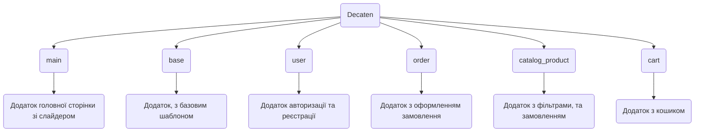

# Decaten
Decaten - це проект, присвячений створенню та підтримці магазину електронних сигарет. Наша мета - забезпечити клієнтам доступ до високоякісних продуктів із сегменту вейпінгу та електронних сигарет за доступними цінами. Використовуючи новітні технології у розробці програмного забезпечення та веб-дизайну, ми забезпечуємо зручну і безпечну платформу для покупок із широким вибором товарів і персоналізованим сервісом для кожного клієнта.

# Змiст
- [Decaten](#decaten)
- [Змiст](#змiст)
- [Запуск та встановлення](#запуск-та-встановлення)
    - [Якщо є Django](#якщо-є-django)
    - [Якщо немає Django](#якщо-немає-django)
- [Учасники команди](#учасники-команди)
- [Опис сторінок проекту](#опис-сторінок-проекту)
- [Використані технології](#використані-технології)
- [Figma та FigJam](#figma-та-figjam)
- [Структура проекту](#структура-проекту)
- [Функціонал проекту](#функціонал-проекту)
  - [Додаток base](#додаток-base)
    - [JavaScript файли](#javascript-файли)
      - [burger.js](#burgerjs)
  - [Додаток cart](#додаток-cart)
    - [Файл з моделями (models.py)](#файл-з-моделями-modelspy)
    - [Файл з функціями відображення (views.py)](#файл-з-функціями-відображення-viewspy)
  - [Моделі проекту](#моделі-проекту)
      - [Модель NameOfFilter](#модель-nameoffilter)
      - [Модель Filter](#модель-filter)
      - [Модель Product](#модель-product)
      - [Модель Flavour](#модель-flavour)
      - [Модель Cart](#модель-cart)
      - [Модель ProductInCart](#модель-productincart)
      - [Модель MyUser](#модель-myuser)

# Запуск та встановлення
- [Якщо є Django](#якщо-є-django)
- [Якщо немає Django](#якщо-немає-django)

### Якщо є Django
1. Завантаження

    Для того щоб запустити проект, потрібно його спочатку завантажити.
    ```
    git clone https://github.com/PrymushAnton/Decaten.git
    ```

2. Запуск
   
    Далі відкриваєте проект у вашому фреймворку і переходьте у папку з ним.
    ```
    cd decaten/decaten
    ```
    Тепер запускаємо проект.
    ```
    python manage.py runserver
    ```

### Якщо немає Django
1. Завантаження

    Для того щоб запустити проект, потрібно завантажити Django.
    ```
    pip install Django
    ```
    Пiсля чого, можно завантажувати проект.
    ```
    git clone https://github.com/PrymushAnton/Decaten.git
    ```

2. Запуск
   
    Далі відкриваєте проект у вашому фреймворку і переходьте у папку з ним.
    ```
    cd decaten/decaten
    ```
    Тепер запускаємо сам проект.
    ```
    python manage.py runserver
    ```

# Учасники команди
1. [Антон Примуш](https://github.com/PrymushAnton) - лідер команди(TeamLead)
2. [Андрiй Дружга](https://github.com/GKAndrey) - кодер та розробник дизайну
3. [Михайло Фатуєв](https://github.com/mishafat) - кодер та розробник дизайну
4. [Ярослав Самчук](https://github.com/YaroslavSamchuk) - кодер та розробник дизайну
   
# Опис сторінок проекту
- **Головна сторiнка** - можливість швидко переглянути наявні пропозиції магазину.
- **Каталог** - на цiй сторiнцi весь список товарiв та фiльтрiв, товар можливо додати до кошику.
- **Кошик** - на цiй сторiнцi можна перевiрити/пiдтвердити замовлення.
- **Авторизацiя та Реєстрація** - на цих сторінках ви можете створити свій акаунт на сайті, та увійти в нього.
# Використані технології
Список бібліотек і технологій, які використовуються в проекті.


- HTML - використовується створення тіла для сторінок
- CSS - використовується створення стилів для сторінок
- Javascript - використовується для front-end розробки
- Python/Django - використовується для back-end розробки
- AJAX - використовується для запобігання перезавантаженню сторінки
- JQuery - використовується для front-end розробки
- Bootstrap 5 - використовується для створення корисних елементів
- SQLite3 - використовується для збереження даних

# Figma та FigJam
- [Figma](https://www.figma.com/design/He9uAMtimSi7BggXDkfste/Decaten?node-id=0-1&t=tU8DNRnSG5MQx48n-1)
- [FigJam](https://www.figma.com/board/FJDA9tQkrUKBHibZFNrBFG/Untitled?node-id=1-14&t=dndBAdC8D6cRroU6-1)

# Структура проекту



# Функціонал проекту

## Додаток base

### JavaScript файли

#### burger.js

Цей файл відповідає за відображення бургер меню (на телефоні)

```javascript
// Коли сторінка завантажилась
$(document).ready(function(){
    // Відкриваємо бургер меню, якщо була натиснута кнопка відкриття
    $('.burger_icon').click(function(){
        $('.header_list').attr('id', 'open')
        $(".burger_close").attr('id', 'burger_open_icon')
        $('.burger_icon').attr('id', 'burger_close_icon')
    })
    // Закриваємо бургер меню, якщо була натиснута кнопка закриття
    $('.burger_close').click(function(){
        $('.header_list').removeAttr('id')
        $(".burger_close").attr('id', 'burger_close_icon')
        $('.burger_icon').attr('id', 'burger_open_icon')
    })

})
```

## Додаток cart
### Файл з моделями (models.py)
```python
# Модель кошику, який створюється за допомогою сесіоного ключа користувача
class Cart(models.Model):
    # Поле, яке відповідає за сесіоний ключ користувача
    sessionkey = models.CharField(max_length=255)

# Модель продукту в кошику
class ProductInCart(models.Model):
    # Поле, яке відповідає за продукт, який було додано до моделі
    product=models.ForeignKey(Product,on_delete=models.CASCADE)
    # Це поле визначає, до якого кошику було додано продукт
    cart=models.ForeignKey(Cart,on_delete=models.CASCADE)
    # Це поле визначає кількість продукту, який було додано в кошик
    count=models.IntegerField()
    # Це поле визначає смак продукту, який було додано в кошик
    flavour = models.ForeignKey(Flavour, on_delete=models.CASCADE, blank=True, null=True)
```
### Файл з функціями відображення (views.py)
```python
# Функція, яка відподає за відображення сторінки кошику
def cart(request):
    # отримуємо сесіоний ключ користувача та записуємо його у змінну
    session_key = request.session.session_key
    # якщо сесіоного ключа немає, тоді створюємо його і записуємо у змінну
    if not session_key:
        request.session.cycle_key()
        session_key = request.session.session_key
    
    # отримуємо всі смаки
    flavours = Flavour.objects.all()

    # намагаємось отримати корзину по сесіоному ключю, якщо вона є
    try:
        cart = Cart.objects.get(sessionkey=session_key)
    # якщо корзину не вдалось знайти, то створюємо її
    except:
        cart = Cart.objects.create(sessionkey=session_key)
        
    # створюємо список, в якому будуть ціни товарів
    prices = []
    # змінна для відображення у хедері кількості всіх товарів у корзині
    count = 0
    # перебираємо queryset з значеннями всіх товарів у корзині
    # cart.productincart_set.all() отримує queryset зі значеннями всіх продуктів, які зберігаються у корзині cart
    for product in cart.productincart_set.all():
        # Фільтруємо та отримуємо значення всіх продуктів, які були у кошику, після чого записуємо їх у список
        product_obj = Product.objects.filter(id=product.product_id).values()
        product_obj = list(product_obj)
        # додаємо до списку з цінами ціну товару, помножену на кількість товару у кошику.
        prices.append(int(product_obj[0]['price']) * product.count)
        # Додаємо кількість товару для відображення у хедері
        count += product.count
        


    context = {
        "products": cart.productincart_set.all(),
        'flavours': flavours,
        'prices': prices,
        'count_cart': count,

    }
    
    return render(request, 'cart/cart.html', context)

# функція, яка відповідає за додавання кількості товару у корзині
def plus_count(request):
    # отримуємо сесіоний ключ користувача та записуємо його у змінну
    session_key = request.session.session_key
    # якщо сесіоного ключа немає, тоді створюємо його і записуємо у змінну
    if not session_key:
        request.session.cycle_key()
        session_key = request.session.session_key
        
    # намагаємось отримати корзину по сесіоному ключю, якщо вона є
    try:
        cart = Cart.objects.get(sessionkey=session_key)
    # якщо корзину не вдалось знайти, то створюємо її
    except:
        cart = Cart.objects.create(sessionkey=session_key)
        
    
    
    try:
        # Отримуємо строку з id товару і смаку товару
        hidden_input = request.POST.get('product_id')
        
        # перероблюємо цю строку у список
        hidden_input = hidden_input.split(',')
        # отримуємо значення продукту, який ми отримали за значенням зі списку
        product_obj = Product.objects.filter(id=hidden_input[1]).values()
        # отримуємо ціну продукту
        price = list(product_obj)[0]['price']
        # отримуємо значення смаку та перероблюємо їх у список, який ми отримуємо за значенням зі списку
        flavour = Flavour.objects.filter(id=hidden_input[0]).values()
        flavour = list(flavour)
        # Отримуємо продукт з кошику за допомогою значень з списку
        product = cart.productincart_set.get(product_id=hidden_input[1], flavour_id=hidden_input[0])
        # Якщо кількість продукту на складі більша, ніж кількість продукту у корзині
        if flavour[0]['count_of_product'] > product.count:
            # додаємо 1 продукт до кількості продукту
            product.count += 1
            # зберігаємо кількість продукту у змінну
            count = product.count
            # отримуємо ціну, яка помножена на кількість товарів (тобто товар коштує 500 грн, 2 товари будуть коштувати 1000 грн)
            final_price = price * count
            # зберігаємо зміни
            product.save()
            
            count_cart = 0
            for product in cart.productincart_set.all():
                product_obj = Product.objects.filter(id=product.product_id).values()
                product_obj = list(product_obj)
                count_cart += product.count
            
            return JsonResponse({'count_cart':count_cart,'price': final_price,"count": count, 'product_id': hidden_input[1], 'flavour_id': hidden_input[0], 'plus': 1})
        else:
            return JsonResponse({'count_cart':count, 'plus': 0})
    except:
        return HttpResponse()
    
    
    
def minus_count(request):
    session_key = request.session.session_key
    if not session_key:
        request.session.cycle_key()
        session_key = request.session.session_key
        
    try:
        cart = Cart.objects.get(sessionkey=session_key)
    except:
        cart = Cart.objects.create(sessionkey=session_key)
    
    
    try:
        hidden_input = request.POST.get('product_id')
        hidden_input = hidden_input.split(',')
        product_obj = Product.objects.filter(id=hidden_input[1]).values()
        price = list(product_obj)[0]['price']
        product = cart.productincart_set.get(product_id=hidden_input[1], flavour_id=hidden_input[0])
        if int(product.count) >= 1:
            product.count -= 1
            product.save()
        if int(product.count) < 1:
            product.delete()

        count = product.count
        final_price = price * count
        
        count_cart = 0
        for product in cart.productincart_set.all():
            product_obj = Product.objects.filter(id=product.product_id).values()
            product_obj = list(product_obj)
            count_cart += product.count
            
        return JsonResponse({'count_cart':count_cart,'price': final_price,"count": count, 'product_id': hidden_input[1], 'flavour_id': hidden_input[0]})
    except:
        return HttpResponse()
    


def delete_product(request):
    session_key = request.session.session_key
    if not session_key:
        request.session.cycle_key()
        session_key = request.session.session_key
        
    try:
        cart = Cart.objects.get(sessionkey=session_key)
    except:
        cart = Cart.objects.create(sessionkey=session_key)
    
    
    try:
        hidden_input = request.POST.get('product_id')
        hidden_input = hidden_input.split(',')
        product = cart.productincart_set.get(product_id=hidden_input[1], flavour_id=hidden_input[0])
        product.delete()
        products = list(cart.productincart_set.all().values())
        print(products)
        
        count = 0
        for product in cart.productincart_set.all():
            product_obj = Product.objects.filter(id=product.product_id).values()
            product_obj = list(product_obj)
            count += product.count
        print(count)
        
        return JsonResponse({'product_id': hidden_input[1], 'flavour_id': hidden_input[0], 'count_cart': count})
    except:
        return HttpResponse()


def error_empty(request):
    session_key = request.session.session_key
    if not session_key:
        request.session.cycle_key()
        session_key = request.session.session_key

    try:
        cart = Cart.objects.get(sessionkey=session_key)
    except:
        cart = Cart.objects.create(sessionkey=session_key)

    
    cart = list(cart.productincart_set.all().values())
    
    return JsonResponse({"products": cart})
```

тут js та views
## Моделі проекту

#### Модель NameOfFilter

Ця модель відповідає за назву категорії фільтрів.

```python
class NameOfFilter(models.Model):
    # поле, яке відповідає за назву категорії фільтрів (наприклад "Кількість затяжок")
    name = models.CharField(max_length=255)
    # відповідає за зручне відображення назви у адмін панелі
    def __str__(self):
        return self.name
```

#### Модель Filter

Ця модель відповідає файлам в категорії.

```python
class Filter(models.Model):
    # поле, яке відповідає за назву нового фільтру в категорії (наприклад назва "8000" в категорії "Кількість затяжок")
    name = models.CharField(max_length=255)
    # поле, яке визначає, якій категорії належить новий фільтр
    name_of_filter = models.ForeignKey(NameOfFilter, on_delete=models.CASCADE)
    # відповідає за зручне відображення назви у адмін панелі
    def __str__(self):
        return self.name
```

#### Модель Product

Ця модель відповідає за продукти, в нашому випадку - електронні сигарети.

```python
class Product(models.Model):
    image = models.ImageField(null=True, blank=True)
    # поле, яке визначає назву продукту
    name = models.CharField(max_length=255)
    # ціна продукту
    price = models.IntegerField()
    # поле, яке приймає одне або декілька значень фільтрів.
    filters = models.ManyToManyField(Filter)
    # відповідає за зручне відображення назви у адмін панелі
    def __str__(self):
        return self.name
```

#### Модель Flavour 

Ця модель відповідає за смаки для електронних сигарет.

```python
class Flavour(models.Model):
    # назва смаку сигарети
    name = models.CharField(max_length=255)
    # це поле визначає, до якого продукту відноситься цей смак
    for_product = models.ForeignKey(Product, on_delete=models.CASCADE, blank=True, null=True)
    # картинка сигарети з смаком
    image = models.ImageField(blank=True, null=True)
    # це поле визначає кількість товарів цього смаку на складі
    count_of_product = models.IntegerField(null=True, blank=True)
    # відповідає за зручне відображення назви у адмін панелі
    def __str__(self):
        return self.name
```

#### Модель Cart

Ця модель відповідає за кошик.

```python
class Cart(models.Model):
    sessionkey = models.CharField(max_length =255)
```

#### Модель ProductInCart

Ця модель відповідає за зображення в слайдері на головній сторінці.

```python
class Carusel(models.Model):
    img = models.ImageField()
```

#### Модель MyUser 

Ця модель відповідає за збереження реєстраційних даних користувача.

```python
class MyUser(User):
    number = models.IntegerField()
```